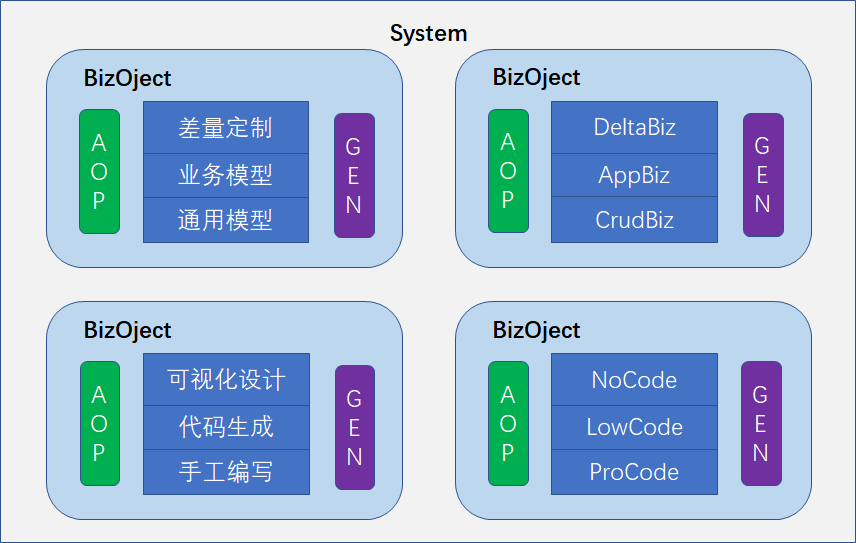

# 从可逆计算看后端服务函数的可扩展设计

很多低代码平台的核心其实就是一个CRUD模型，一般通过内置的扩展点（比如插入前、插入后等）来提供一定的可定制性。Nop平台中CRUD模型没有任何的特殊性，它内置的CrudBizModel仅仅是一个普通的BizModel模型，在Nop平台核心中并没有任何针对CRUD扩展点的特殊处理。在本文中，我将以CrudBizModel为例，讲解一下Nop平台中实现后台服务时的常见扩展方案。

## 一. 通过回调函数提供定制时机

CrudBizModel中的大部分服务函数都采用了两层抽象，上层函数调用下层的实现函数时通过参数和回调函数来实现定制。

```javascript
    public PageBean<T> findPage(@Optional @Name("query") QueryBean query,
                                FieldSelectionBean selection, 
                                IServiceContext context) {
        return doFindPage0(query, getBizObjName(), prepareQuery, 
                   selection, context);
    }

    @BizAction
    public PageBean<T> doFindPage0(@Name("query") QueryBean query,
                                   @Name("authObjName") String authObjName,
                                   @Name("prepareQuery") BiConsumer<QueryBean, 
                                   IServiceContext> prepareQuery, 
                                   FieldSelectionBean selection,
                                   IServiceContext context) {
         query = prepareFindPageQuery(query, authObjName, 
                     METHOD_FIND_PAGE, prepareQuery, context);                      
        ...
    }
```

findPage函数是通过`doFindPage0`这个可扩展的函数来实现，`doFindPage0`提供了两个可配置的参数

1. **authObjName** : 缺省情况下它的值对应于当前的业务对象名(bizObjName)，指定不同的值可以在不同业务场景下应用不同的数据权限过滤条件。
2. **prepareQuery**: query参数对应于前端传入的查询条件，后台根据XMeta模型配置校验所有查询字段和查询运算符都在允许范围之内。prepareQuery回调函数可以在前台传入的query条件基础上增加额外的查询条件，而且在这里追加的查询条件不需要进行校验。

使用回调函数相当于是提供了一种基于组合的扩展方式，它比基于类继承和函数重载的方式要更加灵活。

## 二. 利用XMeta元数据模型统一动态处理模式

一般的函数复用只是复用一模一样的处理逻辑，最多是通过几个回调函数来提供有限的扩展点，但很多时候并不存在完全一样的处理逻辑，**我们能够抽象只是一种处理模式**。例如，save函数的基本处理逻辑如下：

1. 验证前台提交的字段信息
2. 对于支持逻辑删除的实体，需要检查是否存在标记为删除的实体
3. 检查数据库中不存在重复的记录，比如不允许多个用户具有同样的身份证等
4. 根据请求数据创建实体对象，对于复杂的主子表结构需要进行特殊处理

每种不同实体的save逻辑的整体结构是完全一致的，但具体的细节不同。比如每个字段的类型和校验规则都不同，部分字段还需要执行转换逻辑，将前台传入的值转换为后台要求的格式等。不同实体上用于区分唯一性的字段也不同。
在Nop平台中每个业务对象都可以关联一个XMeta文件，通过它可以定义业务对象的元数据。

> XMeta元数据比Java的注解要更加灵活和强大，它支持元编程和自定义扩展，通过XDef元模型自动进行结构校验。关于XMeta的介绍，参见[xmeta.md](../xlang/xmeta.md)

```java
   public T save(@Name("data") Map<String, Object> data, IServiceContext context) {
        return doSave(data, null, this::defaultPrepareSave, context);
   }

    @BizAction
    public T doSave(@Name("data") Map<String, Object> data, 
                    @Name("inputSelection") FieldSelectionBean inputSelection,
                    @Name("prepareSave") BiConsumer<EntityData<T>, 
                    IServiceContext> prepareSave, 
                    IServiceContext context) {
        if (CollectionHelper.isEmptyMap(data))
            throw new NopException(ERR_BIZ_EMPTY_DATA_FOR_SAVE)
                 .param(ARG_BIZ_OBJ_NAME, getBizObjName());

        // 1. 根据XMeta配置实现输入校验和转换
        ObjMetaBasedValidator validator = 
            new ObjMetaBasedValidator(bizObjectManager, bizObj.getBizObjName(),
                objMeta,context, true);

        Map<String, Object> validated = 
              validator.validateForSave(data, inputSelection);

        // 2. 根据ORM实体模型参数判断是否启用逻辑删除
        T entity = recoverLogicalDeleted(data, objMeta);
        boolean recover = true;
        if (entity == null) {
            recover = false;
            entity = dao().newEntity();
        }

        EntityData entityData = new EntityData<>(data, validated, entity, objMeta); 

        // 3. 根据XMeta上配置的唯一键检查重复记录
        checkUniqueForSave(entityData);

        // 4. 根据XMeta配置确定如何将主子表数据设置到新建的实体对象上
        new OrmEntityCopier(daoProvider, bizObjectManager)
                .copyToEntity(entityData.getValidatedData(),
                    entityData.getEntity(), null, entityData.getObjMeta(), 
                    getBizObjName(), BizConstants.METHOD_SAVE, 
                    context.getEvalScope());

        // 5. 检查实体设置属性后满足数据权限要求，对当前用户可见
        checkDataAuth(BizConstants.METHOD_SAVE, entityData.getEntity(), context);

        // 6. 执行额外的定制逻辑
        if (prepareSave != null)
            prepareSave.accept(entityData, context);

        doSaveEntity(entityData, context);

        return entityData.getEntity();
    }
```

Nop平台提供了通用的ObjMetaBasedValidator和OrmEntityCopier，它们可以利用XMeta元数据模型中的信息来**统一实现**输入校验以及实体对象构建。

类似的方案频繁用在各种通用处理函数中，例如findTreeEntityPage利用XMeta中的TreeModel配置来生成属性结构的查询语句。

使用XMeta还有一个好处是支持Delta定制。我们在不同的应用中对于同一个业务对象可以使用不同的XMeta模型，从而定制实际处理的内容。如果使用强类型的DTO对象就很难在不修改基础产品源码的情况下实现逻辑定制。

**GraphQL的对象组合能力与XMeta的对象结构抽象能力，以及可逆计算的差量化能力结合在一起，可以将大部分CRUD相关的逻辑固化下来。一般不需要编写CRUD相关的代码，也不需要针对不同的场景生成大量代码**，通过统一的实现即可完成主体需求，我们最多只需要向CRUD模型补充偏离标准CRUD处理过程的差量信息即可。

## 三. 通过前缀引导语法在局部扩展领域模型

Nop平台提供的是一种面向语言编程范式(Language Oriented Programming)，也就是说，为了解决当前的业务问题，我们不是直接使用通用语言，而是先建立一个领域特定语言(DSL)，然后用这个语言去表达业务逻辑。

不用把DSL看得特别神秘复杂，它其实只是模型的一种文本展现形式。DSL化的本质是模型化，只要我们对业务问题建立了一个抽象模型，然后为它选择一种文本表达形式，它就自然成为了一种DSL。

在前后端分离和微服务的背景下，前端和后端之间、后端服务之间的所有交互都要通过序列化后的对象数据。如果我们在语义层面上归拢相关的功能，对外只暴露少量粗粒度的服务接口，那么这个服务接口的参数就相当于是某种DSL。

**服务函数可以看作是某种执行DSL的虚拟机，传入的参数不同会指导虚拟机执行不同的处理逻辑**。举个具体的例子，CrudBizModel中提供的findPage/findList等通用查询函数，它们所接收的查询条件对象QueryBean就可以看作是一种DSL，它描述了针对一个复杂对象结构的组合查询条件。

```
POST /r/NopAuthDept__findPage

{
   "query": {
      "filter": {
          "$type": "or",
          "$body": [
             {
                "$type": "eq",
                "name": "status",
                "value": 1
             },
             {
                "$type": "gt",
                "name": "parent.status",
                "value": 2
             }
          ]
      },
      "orderBy":[
         {
           "name": "status",
           "desc" : false
         }
      ]
   }
}
```

query对象在后台对应于QueryBean结构，它是一个通用的查询模型，可以在XML格式和JSON格式之间自由转换。

```xml
<query>
  <filter>
     <or>
       <eq name="status" value="1" />
       <gt name="parent.status" value="2" />
     </or>
  </filter>
  <orderBy>
     <field name="status" desc="false" />
  </orderBy>
</query>
```

通过QueryBean查询模型，我们可以表达包含嵌套and/or关系的复杂查询条件，而且借助于NopORM引擎的关联查询能力，我们可以通过`parent.status`这种复合属性语法来自动实现主子表关联查询。

> 一般情况下通过一个统一的findPage函数就足以完成各种业务查询，不需要单独编写大量的查询函数。可以通过XMeta模型来控制哪些字段能够支持哪些查询运算符，最多一次能查询几个字段等，防止前端构造复杂查询形成拒绝服务攻击。

**每个模型都是可以看作是一个DSL，而同一个DSL在不同的应用场景下可以用不同的解释器去解释运行**。仍然是以QueryBean模型为例，我们可以将它转换为SQL语句送到数据库中执行，也可以将它编译为内存中运行的Predicate函数。规则引擎可以使用QueryBean模型来表达复杂判断条件，而前台的业务规则设计器可以根据DSL的内容自动生成可视化展现和编辑工具等。


Nop平台内置了大量DSL，并且提供了各种表象变换手段（比如每个DSL都自动具有Excel表象，无需编程可以通过Excel来），支持DSL之间的无缝嵌入。这使得我们在做一般的业务开发的时候并不需要创建新的DSL。
但是这并不意味着我们只能使用Nop平台内置的模型语义。Nop平台中所有的模型在实际执行之前都会经过多次模型变换，在这个过程中我们可以引入自己的DSL语法翻译规则，从而为已有的DSL模型增加新的扩展语义。

一个在Nop平台中常用的技巧是使用前缀引导语法。具体来说就是引入一个特别的前缀，比如`@filter:`，通过它**将一个值增强为一个可以被解释器增强的领域结构**。

> 关于前缀引导语法的详细介绍，参见我的文章 [DSL分层语法设计及前缀引导语法](https://zhuanlan.zhihu.com/p/548314138)

这种做法的好处是可以基本保证原有DSL模型的整体形式不变，仅在局部进行扩展，从而可以和其他的语法结构组合在一起。

比如有人提出一个特殊的查询需求，希望能够以简洁的方式过滤掉已经被选中的记录。这一需求可以使用前缀引导语法表示为

```xml
<notIn name="id" value="@filter:selectedItemIds" />
```

CrudBizModel中所有的查询条件都会应用全局的IQueryTransformer转换器。

```java
public interface IQueryTransformer {
    void transform(QueryBean filter, String authObjName, String action,
                   IBizObject bizObj, IServiceContext context);
}
```

结合上一节中XMeta的能力，我们可以通过bizObj获取到XMeta中的扩展配置信息，从而决定`@filter:`前缀后面的表达式如何解释。一种可行的做法是直接将它映射为某个Xpl模板标签，然后生成子查询语句或者动态获取到对应的数据集合。

## 四. 通过XBiz模型增加服务函数

Nop平台在逻辑的全局组织结构层面广泛采用类似Docker镜像切片的分层叠加结构。对于后台服务而言，Nop平台的做法是将业务对象BizObject分解为具有不同优先级的多个切片。



举例来说，Java编写的CrudBizModel可以看作是一个基础的行为切片，它采用ProCode模式开发。每个业务对象都有一个配对的XBiz模型文件（XML格式），它相当于是一种扩展BizModel的DSL语言，
在其中我们可以使用XML语法来定义业务方法。XBiz模型相当于是一种优先级更高的行为切片，它覆盖在底层的CrudBizModel之上。如果在XBiz模型中定义了同名的服务方法，则会直接覆盖Java中的实现。如果没有重名，则会为业务对象新增业务方法。在更上层，可以是无代码编程模式下引入的动态行为切片，它可以保存在数据库的某个动态模型定义表中，在启动的时候自动加载发布为虚拟文件系统中的一个模型文件，然后利用虚拟文件系统的Delta定制机制覆盖原有的XBiz文件。

```xml
<biz x:schema="/nop/schema/biz/xbiz.xdef" xmlns:x="/nop/schema/xdsl.xdef"
     x:extends="_NopAuthUser.xbiz" xmlns:bo="bo" xmlns:c="c">

    <actions>
        <query name="active_findPage" x:prototype="findPage">

            <source>
                <c:import class="io.nop.auth.api.AuthApiConstants" />

                <bo:DoFindPage query="${query}" selection="${selection}" xpl:lib="/nop/biz/xlib/bo.xlib">
                    <filter>
                        <eq name="status" value="${AuthApiConstants.USER_STATUS_ACTIVE}" />
                    </filter>
                </bo:DoFindPage>
            </source>
        </query>
    </actions>
</biz>
```

* XBiz模型可以通过通用的`x:extends`语法来继承已有的模型文件或者代码生成器自动生成的模型文件。
* 在`<source>`段中我们可以使用Xpl模板语言中的自定义标签来实现自定义封装。**Xpl模板语言提供了隐式参数和编译期变换等机制，可以实现比一般程序语言更简洁的领域特定表达**。

例如`bo.xlib`标签中提供了对于CrudBizModel中`doFindPage/doFindList`等函数的封装。

```xml
<source>
    <bo:DoFindPage bizObjName="NopAuthUser" xpl:lib="/nop/biz/xlib/bo.xlib" selection="items{name,status}">
       <filter>
          <c:if test="${xxx}">
             <eq name="status" value="1" />
          </c:if>  

          <!--可以使用更简洁的表达方式 -->
          <eq name="status" value="1" xpl:if="xxx" />
       </filter>
    </bo:DoFindPage>
</source>
```

* `<bo:DoFindPage>`标签如果指定了`bizObjName`参数就会调用指定业务对象上的方法，否则会调用当前上下文中的`thisObj`对象上的方法。
* 如果指定了selection参数，则会在获取到实体对象之后自动调用`dao.batchLoadSelection(entityList,selection)`函数，批量加载所有指定的属性，避免后续访问时逐个触发延迟加载影响性能。
* `<bo:DoFindPage>`标签的filter子节点本质上是提供了第一节中提到的`doFindPage`函数的`prepareQuery`回调函数，这里可以使用Xpl模板语言来动态生成查询条件。

这个标签中的bizObjName属性和selection属性的具体实现方式很有意思，它们都是利用了Xpl自定义标签的编译期转换机制来实现。

```xml
 <DoFindPage>
    <attr name="query" optional="true" type="io.nop.api.core.beans.query.QueryBean"/>
    <attr name="authObjName" optional="true" type="String" />
    <attr name="selection" optional="true" type="io.nop.api.core.beans.FieldSelectionBean"/>
    <attr name="bizObjName" optional="true" />
    <attr name="thisObj" implicit="true" type="io.nop.biz.api.IBizObject"/>
    <attr name="svcCtx" implicit="true" type="io.nop.core.context.IServiceContext"/>


    <transform>
         <c:script><![CDATA[
            const bizObjName = node.attrText('bizObjName');
            if(bizObjName != null){
               $.checkArgument(bizObjName.$isValidSimpleVarName(),"bizObjName");
               node.setAttr(node.attrLoc('bizObjName'),'thisObj', "${inject('nopBizObjectManager').getBizObject('" +bizObjName+"')}");
            }
            const selection = node.attrText('selection');
            if(selection and !selection.contains('${')){
                node.setAttr(node.attrLoc('selection'),'selection', "${selection('"+selection+"')}");
            }
        ]]></c:script>
    </transform>
    <source>
      ...
    </source>
</DoFindPage>        
```

在编译期发现了bizObjName或者selection参数非空，会自动将它们转换为表达式

```xml
<bo:DoFindPage thisObj="${inject('nopBizObjectManager').getBizObject('NopAuthUser')}"
    selection="${selection('items{name,status}')}">
  ...
</bo:DoFindPage>
```

* selection函数是一个全局宏函数，它会在编译期解析自己的参数将它转换为一个`FieldSelectionBean`对象。在运行期直接使用解析好的结果，不用重复解析。

* 如果和使用Java语言去实现同样功能做比较，可以明显发现Xpl标签在调用的时候更加简洁，可以避免重复表达那些可以自动推导出来的信息。

* 可以想象一下如果要表达 "指定了bizObjName参数就调用指定对象，否则就调用thisObj当前对象"这一逻辑如何表达？当我们不需要使用thisObj的时候能否在DSL描述中完全屏蔽这一概念。

## 五. 通过元编程增强XBiz模型

一旦引入XBiz这样的DSL模型文件，就可以立刻施展标准化的元编程套路，为DSL模型引入更多的自定义扩展。例如，在XBiz文件中，我们可以通过如下方式引入逻辑编排支持。

```xml
<biz>
  <x:post-extends>
    <biz-gen:TaskFlowSupport xpl:lib="/nop/core/xlib/biz-gen.xlib"/>
  </x:post-extends>

  <actions>
    <mutation name="callTask" task:name="test/DemoTask"/>
  </actions>
</biz>
```

* `x:post-extends`在模型解析的编译期自动执行，通过`<biz-gen:TaskFlowSupport>`标签会自动对具有`task:name`的函数节点进行变换，自动生成调用TaskFlowManager的代码。

* 我们可以使用可视化的逻辑编排设计器来设计`Task`，然后在XBiz模型中只要为服务函数指定它所关联的`task:name`即可。

详细的介绍参见 

* [通过NopTaskFlow逻辑编排实现后台服务函数](../workflow/task-flow-for-biz.md)

* [XDSL：通用的领域特定语言设计](https://zhuanlan.zhihu.com/p/612512300)


