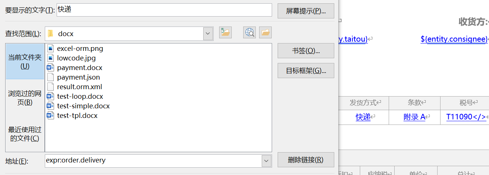
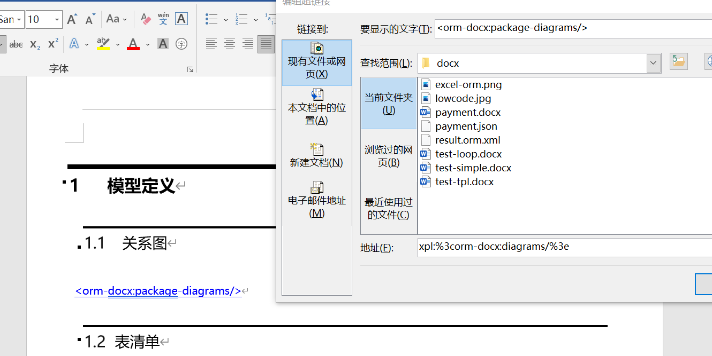
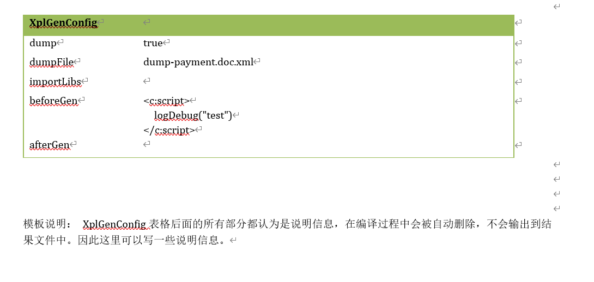

在Word文件中增加少量标注即可将它转化为一个导出模板。

# 1. 为模板中需要被替换的文字增加超链接



链接的文本可以是示例内容，例如快递，而**链接地址的格式为`expr:EL表达式`**，用于表达如何获取数据，例如expr: order.delivery。

超链接这一元素可以保留所有样式设置，而且它的插入位置在文档结构中是准确的（插入域则有时会在段落之外）。同时相比于poi-tl直接在文档中插入文本内容，使用超链接可以更好的保持原有的展现结构。特别是当表达式内容较长时，可以使用示例文字代替，不会出现因文字过长而导致表格变形或者换行等情况。表达式通过超链接来表达可以避免占用显示空间，当鼠标放到超链接上的时候会自动显示相关内容。

如果界面上的显示空间足够，也可以使用链接的文本作为表达式，此时链接地址的格式为`expr:`或者`xpl:`，即链接地址中没有表达式内容时，会使用链接的文本作为表达式。例如图中的`${entity.consignee}`

> expr：表示插入EL表达式，内置的表达式语法接近于JavaScript
> 
> xpl: 表示插入xpl模板语言片段，它支持a${b}c这种嵌入式的表达式输出，也支持更复杂的标签结构。

## 2. 超链接可以表示插入完整的代码块



通过`xpl:`超链接可以插入完整的xpl标签，在具体的标签实现中可以输出任意代码块。例如

```
<package-diagrams outputMode="xml">
   <source>
       ....
       <w:drawing>
         ...
       </w:drawing>
   </source>
</package-diagrams>
```

## 3. 通过插入配对的超链接来表示嵌套的块结构


可以插入配对的超链接 `xpl:<c:for var="order" items="${entity.orders}>"`和`xpl:</c:for>`表示它们之间的内容需要被包裹到一个`<c:for>`循环标签中。

与poi-tl相比，这种做法更加灵活，可以引入自定义标签，具有严格的变量作用域定义，也不需要引入各种特殊的约定语法。

## 4. 为需要被替换的图片增加超链接


通过expr可以指定图片资源对象（表达式的返回结果是IResource接口即可）。与poi-tl的图片嵌入方式相比，这种方式可以对图片大小和显示方式进行可视化调整。

## 5. 直接嵌入EL表达式

在word文本中可以直接插入 `${expr}`这种EL表达式。有的时候因为字体的原因，会导致一个表达式被拆分成多个`<w:t>`标签，导致EL表达式没有被正确解析。
此时可以将表达式文本选中，然后增加超链接，链接内容设置为`xpl:`即可。另外需要注意`${`等字符必须是英文字符，不要误用为中文字符。
如果确实要在最终结果中输出`${`字符，可以采用转义的方式: `${'$'}{'`。

## 6. 通过XplGenConfig配置引入初始化代码

poi-tl是所谓无逻辑「logic-less」的模板引擎，没有复杂的控制结构和变量赋值，只有标签。这种做法降低了模板引擎实现的复杂度，但是也导致数据准备工作需要在java代码中实现，同时导致模板内置渲染策略比较死板，稍微偏离缺省设计场景可能就需要在java中单独编程实现。

如果我们希望实现一个Word模板管理平台，则模板本身必须具备一定的逻辑独立性，很多初始化和数据准备工作应该在模板内部完成，而不是依赖于外部代码来准备上下文数据变量。



可以在模板的尾部插入一个XplGenConfig配置表格，它支持如下配置项

* dump: 模板在编译的时候会被转化为XPL模板语言的代码，这里的开关控制是否将转化后结果打印出来方便调试查看

* dumpFile: 当dump=true的时候，控制转换后代码需要被输出到哪个文件中。这个过程会对xml进行格式化(docx文件中的xml缺省是没有任何缩进的，因此查看并不方便)。

* importLibs: 引入自定义的标签库。缺省引入了/nop/ooxml/xlib/docx-gen.xlib

* beforeGen: 在模板生成前执行的初始化代码

* afterGen: 在模板生成后执行的代码

Word模板会被转换为XPL模板语言之后再作为XPL模板编译并输出。转换后的代码通过dumpFile可以查看，大致结构类似

```xml
<c:unit>
  <c:import from="/nop/test/orm-docx.xlib"/>
  <c:import from="/nop/ooxml/xlib/docx-gen.xlib"/>
  <c:out escape="none"><?xml version="1.0" encoding="UTF-8"?>
</c:out>
  <c:unit xpl:outputMode="none">
    <c:script>logInfo("test")</c:script>
  </c:unit>
  <w:document>
      ...
  </w:document>
</c:unit>
```

当xpl模板编译发现错误时，会抛出异常，其中包含有错误信息和准确的行号。行号对应于dumpFile文件中的位置，例如

```
io.nop.api.core.exceptions.NopEvalException: 
NopEvalException[seq=1,errorCode=nop.err.commons.text.scan-unexpected-char,
params={pos=19, reader=${model.displayNam[e], expected=}, eof=true},
desc=读取到的下一个字符不是期待的字符[}]]
@_loc=[68:35:0:0]file:/C:/can/entropy-cloud/nop-ooxml/nop-ooxml-docx/dump-tpl.doc.xml
  @@c:unit/w:document/w:body/w:p[2]/w:r/w:t@@[68:12:0:0]file:/C:/can/entropy-cloud/nop-ooxml/nop-ooxml-docx/dump-tpl.doc.xml
```

以上错误信息表示在dump-tpl.doc.xml的第68行的第35列出现语法错误，同时还显示了XLang语言内部的堆栈信息而不是Java函数的堆栈信息，实际对应的代码内容为

```xml
  <w:t>${model.displayName</w:t>
```

具体的模板示例和输出结果

[payment.docx](https://gitee.com/canonical-entropy/nop-entropy/tree/master/nop-ooxml/nop-ooxml-docx/src/test/resources/payment.docx)

[result-payment.docx](https://gitee.com/canonical-entropy/nop-entropy/tree/master/nop-ooxml/nop-ooxml-docx/src/test/resources/result-payment.docx)
