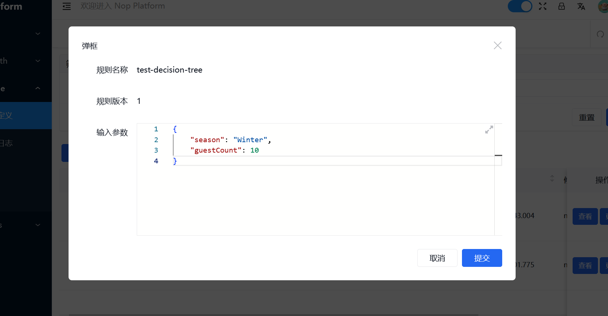
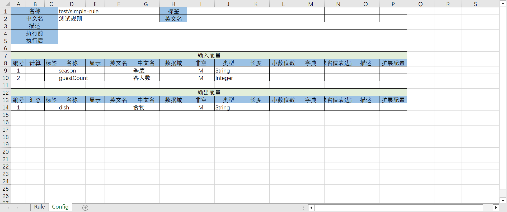
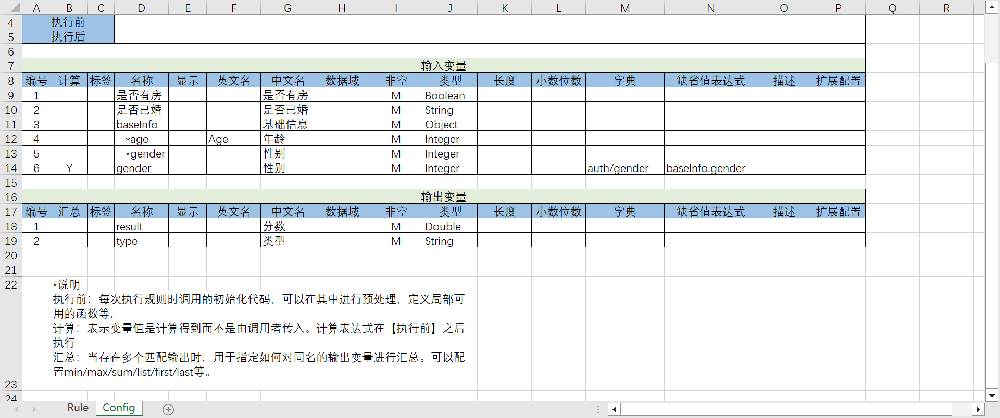
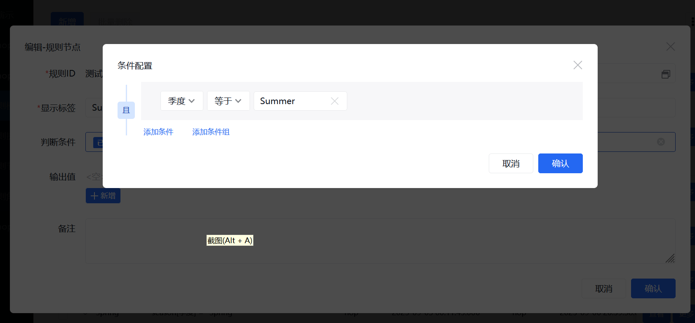

# 采用Excel作为可视化设计器的规则引擎 NopRule

决策树和决策矩阵是业务人员可以直观理解的复杂IF-ELSE逻辑表达形式，也是规则引擎中最常用、最有用的部分。常见的规则引擎如Drools虽然提供了更加丰富的功能特性集，
特别是所谓的RETE算法可以用于高效复用多次重复出现的表达式片段，但在实际业务应用中很少出现必须使用RETE算法的情况，大部分情况下我们都是把规则引擎降级为决策表和决策矩阵来使用。

> 合理安排决策树和决策矩阵的节点顺序已经可以起到优化执行的作用。对于必须使用RETE算法的情况往往一般人已经难以直观理解，难以交给业务人员直接配置。
> 甚至程序员理解其中的执行细节也存在困难，还不如手工实现更加便于优化。基本的决策表+类似流程图的执行控制往往比使用RETE算法更加合用。

NopRule是一个非常轻量级的规则引擎，它可以嵌入在Java程序内部使用，也可以作为微服务被远程调用。
它提供了在线可视化设计界面，可以将规则模型保存在数据库中实现动态更新，同时也可以使用静态的模型文件，不依赖数据库存储。

与NopReport报表引擎类似，NopRule可以使用Excel作为可视化设计工具，直接导入Excel格式的规则模型，极大简化了业务规则的设计和使用。

## 一. 使用方式

仿照nop-quarks-demo工程中的做法，在pom文件中可以引入如下模块

```xml
    <dependency>
        <groupId>io.github.entropy-cloud</groupId>
        <artifactId>nop-rule-service</artifactId>
    </dependency>

    <dependency>
        <groupId>io.github.entropy-cloud</groupId>
        <artifactId>nop-rule-web</artifactId>
    </dependency>
```

nop-rule-service提供后端规则服务。nop-rule-web包含对应的amis前端管理页面。

在`/_vfs/nop/demo/app.action-auth.xml`中引入nop-rule.action-auth.xml，其中定义了用于测试的功能菜单

```xml
<auth x:extends="/nop/auth/auth/nop-auth.action-auth.xml,/nop/sys/auth/nop-sys.action-auth.xml,
    /nop/rule/auth/nop-rule.action-auth.xml">
</auth>
```

启动后访问http://localhost:8080/#/NopRuleDefinition-main


## 1.1 规则调用

可以通过[RuleService](https://gitee.com/canonical-entropy/nop-entropy/blob/master/nop-rule/nop-rule-api/src/main/java/io/nop/rule/api/RuleService.java)接口调用远程规则服务

```javascript
Map<String,Object> inputs = new HashMap<String,Object>();
inputs.put("season","Winter");
inputs.put("guestCount",10);

RuleRequestBean request = new RuleRequestBean();
request.setRuleName("test-decision-table");
request.setInputs(inputs);

RuleResponseBean response = ruleService.executeRule(ApiRequest.build(inputs)).get();
Map<String,Object> outputs = response.getOutputs();
```

如果是嵌入在Java程序内部使用，则可以直接使用IRuleManager接口，减少请求对象的包装转换

```javascript
IRuleManager ruleManager = getRuleManager();
IRuleRuntime ruleRt = ruleManager.newRuntime();
ruleRt.setInput("season", "Winter");
ruleRt.setInput("guestCount", 4);
Map<String, Object> output = ruleManager.executeRule("test/test-table", null, ruleRt);
System.out.println(JsonTool.serialize(ruleRt.getLogMessages(), true));
assertEquals("Roastbeef", output.get("dish"));
```

具体示例参见 [TestRuleExprParser](https://gitee.com/canonical-entropy/nop-entropy/blob/master/nop-rule/nop-rule-core/src/test/java/io/nop/rule/core/expr/TestRuleExprParser.java)

使用RuleManager嵌入调用的时候可以传入复杂的输入对象，而作为RuleService调用的时候输入变量应该是JSON数据。

## 1.2 导入模型

在【规则模型】的管理页面上，新增以及修改的时候都可以通过上传Excel模型文件来导入模型定义。


## 1.3 测试规则

导入规则模型之后，点击行数据上的【测试规则】按钮，可以弹出测试页面。



点击提交按钮之后，会弹出结果显示页，其中**包含了返回的输出变量集合，以及规则执行过程中产生的详细日志信息，从中可以看出具体规则节点的匹配顺序和匹配结果**。

## 二. 配置

## 2.1 Excel模型配置

Excel规则模型必须包含两个Sheet，其中Rule表单配置决策规则，而Config表单配置输入输出变量等描述信息。



输入变量是规则模型中用于判断的那些变量，而输出变量是满足匹配条件的那些规则节点所产生的输出。为了支持在线可视化设计，我们需要为输入输出变量指定显示名和数据类型。

**输入变量支持复杂对象结构**。


1. 在变量名前增加`*`号可以表示嵌套对象结构，增加几个`*`号表示对应第几个层级
2. 通过设置【计算】列为Y，则表示这个属性不是由外部调用者传入的，而是根据输出数据和上下文环境变量动态计算得到的值，计算使用的表达式由【缺省表达式】列指定
3. 业务规则匹配时有可能会匹配到多个执行分支，每个分支都可能会产生输出变量，通过指定【汇总】列，我们可以指定如何根据综合多个输出结果产生最终返回的output值。

## 2.2 Rule表达式

在输入列的单元格中配置规则判断表达式RuleExpr，它的语法有些类似Friendly Enough Expression Language (FEEL)，是XLang Expression的一个更容易阅读的版本，使用[RulExprParser](https://gitee.com/canonical-entropy/nop-entropy/blob/master/nop-rule/nop-rule-core/src/main/java/io/nop/rule/core/expr/RuleExprParser.java)来解析。


1. true和false可以直接指定是否匹配

2. 减号-表示true，直接匹配

3. 数值型表示严格匹配

4. 引号包裹的字符串表示严格匹配

5. 如果是单个变量名则不把它作为变量来解释，而是看作是字符串值。如果要表示等于变量，则应该使用 == myVar这种形式

6. 支持比较操作符和and/or/not，并且支持括号。所有支持比较操作符在[FilterOp](https://gitee.com/canonical-entropy/nop-entropy/blob/master/nop-core/src/main/java/io/nop/core/model/query/FilterOp.java)类中定义

7. 支持所有XScript中注册的全局函数

## 规则匹配后自动执行函数
有时我们希望Rule表达式匹配后，通过一个复杂的函数来动态生成输出变量。此时可以在输出变量栏中调用自定义函数。在【Config】这个Sheet中可以定义函数。


## 2.3 决策表配置

决策表的配置示例可以参见 [decision-tree.rule.xlsx](https://gitee.com/canonical-entropy/nop-entropy/blob/master/nop-rule/nop-rule-service/cases/io/nop/rule/service/entity/TestNopRuleDefinitionBizModel/testImport/input/decision-tree.rule.xlsx)


决策表的左上角的内容必须是字母T，表示Table。然后是输入列和输出列。输入列和输出列的每一列都是对应的输入输出变量名。

## 2.4 决策矩阵配置

决策矩阵的配置示例可以参见 [decision-matrix.rule.xlsx](https://gitee.com/canonical-entropy/nop-entropy/blob/master/nop-rule/nop-rule-service/cases/io/nop/rule/service/entity/TestNopRuleDefinitionBizModel/testDecisionMatrix/input/decision-matrix.rule.xlsx)


决策表的左上交的内容必须是字母M，表示Matrix。


1. 在左侧的每一列以及头部的每一行的第一个单元格中可以配置输入变量名。
2. 单元格中可以通过批注valueExpr来指定表达式，此时单元格文本仅作为显示用的label。如果不配置，则以单元格的文本为表达式。
3. 可以配置输出多个结果值

### 2.5 在线修改

对于决策树模型可以通过在线页面进行修改，规则匹配条件的配置使用AMIS的ConditionBuilder控件



## 三. 设计原理

在Nop平台的整体设计中，NopRule负责的是对复杂判断逻辑的抽象，这其中最核心的部分是Filter模型


## 3.1 Filter模型

filter模型由[filter.xdef](https://gitee.com/canonical-entropy/nop-entropy/blob/master/nop-xdefs/src/main/resources/_vfs/nop/schema/query/filter.xdef)元模型来定义，它可以用于描述复杂的and/or条件

```xml
<and>
    <or>
        <eq name="status" value="1" />
        <eq name="status" value="2" />
    </or>
    <gt name="amount" value="3" />
</and>
```

1. Nop平台在所有需要表达判断条件的地方都统一使用Filter模型,在Java程序中对应ITreeBean类型
2. 利用XML和JSON的双向转换，Filter模型可以保存为XML格式或者JSON格式
3. Nop平台中高级查询使用的就是Filter模型，后台通过[FilterBeanToSQLTransformer](https://gitee.com/canonical-entropy/nop-entropy/blob/master/nop-core/src/main/java/io/nop/core/lang/sql/FilterBeanToSQLTransformer.java)类将它转换为SQL语句
4. 前端AMIS的ConditionBuilder控件可以将复杂判断条件保存为Condition对象。[ConditionExprHelper](https://gitee.com/canonical-entropy/nop-entropy/blob/master/nop-web-page/src/main/java/io/nop/web/page/condition/ConditionExprHelper.java)负责实现Condition和Filter模型之间的双向转换。
5. Filter模型可以通过[FilterBeanToPredicateTransformer](https://gitee.com/canonical-entropy/nop-entropy/blob/master/nop-rule/nop-rule-core/src/main/java/io/nop/rule/core/model/compile/FilterBeanToPredicateTransformer.java)编译得到IEvalPredicate接口，直接在内存中执行过滤逻辑，
6. Filter模型也可以通过[FilterBeanEvaluator](https://gitee.com/canonical-entropy/nop-entropy/blob/master/nop-core/src/main/java/io/nop/core/model/query/FilterBeanEvaluator.java)在内存中执行
7. Filter模型与表达式语言Expression之间可以利用[FilterBeanExpressionCompiler](https://gitee.com/canonical-entropy/nop-entropy/blob/master/nop-xlang/src/main/java/io/nop/xlang/xpl/tags/FilterBeanExpressionCompiler.java)和[ExpressionToFilterBeanTransformer](https://gitee.com/canonical-entropy/nop-entropy/blob/master/nop-xlang/src/main/java/io/nop/xlang/expr/filter/ExpressionToFilterBeanTransformer.java)进行可逆转换，

## 3.2 Schema模型

Nop平台中所有需要定义对象类型的地方都统一使用schema模型，它由元模型[schema.xdef](https://gitee.com/canonical-entropy/nop-entropy/blob/master/nop-xdefs/src/main/resources/_vfs/nop/schema/schema/schema.xdef)来定义。

1. XDef元模型和Schema模型之间可以相互转换。XDef用于定义XML结构，而Schema用于定义对象以及JSON结构。
2. 通过[SimpleSchemaValidator](https://gitee.com/canonical-entropy/nop-entropy/blob/master/nop-xlang/src/main/java/io/nop/xlang/xmeta/SimpleSchemaValidator.java)可以检查value是否满足schema规范要求
3. 通过[XSchemaToJsonSchema](https://gitee.com/canonical-entropy/nop-entropy/blob/master/nop-xlang/src/main/java/io/nop/xlang/xmeta/jsonschema/XSchemaToJsonSchema.java)可以将schema对象转换为JSON Schema定义
4. [ConditionSchemaHelper](https://gitee.com/canonical-entropy/nop-entropy/blob/master/nop-web-page/src/main/java/io/nop/web/page/condition/ConditionSchemaHelper.java)负责将规则模型中的输入变量定义转换为前端ConditionBuilder控件所支持的schema定义。

## 3.3 Excel数据模型

Nop平台提供了Excel数据模型和Java领域模型对象之间的双向转换，因此无需编程，就可以实现Excel解析以及将对象导出为Excel文件的功能。具体介绍参见[excel-import.md](https://gitee.com/canonical-entropy/nop-entropy/blob/master/docs/dev-guide/report/excel-import.md)

* NopRule在解析Excel格式的规则模式时，对于Config表单页的解析就是使用的标准Excel转换技术。

```
 RuleModel rule = ImportModelHelper.parseSheet(sheetModel, configSheet, compileTool, scope, RuleModel.class);
```

* NopRule使用Excel格式的API模型来定义对外服务接口，自动生成对应的接口定义和服务框架类，参见[nop-rule.api.xlsx](https://gitee.com/canonical-entropy/nop-entropy/blob/master/nop-rule/model/nop-rule.api.xlsx)

## 总结

NopRule的实现采用了Nop平台的基本技术战略：

1. 通过元模型来定义领域模型
2. 尽量通过自动推导实现模型之间的双向转换，减少硬编码
3. 通过复用底层的通用模型，如Filter、Expression等，我们可以快速组装出更复杂的领域模型，如规则模型

基于可逆计算理论设计的低代码平台NopPlatform已开源：

- gitee: [canonical-entropy/nop-entropy](https://gitee.com/canonical-entropy/nop-entropy)
- github: [entropy-cloud/nop-entropy](https://github.com/entropy-cloud/nop-entropy)
- 开发示例：[docs/tutorial/tutorial.md](https://gitee.com/canonical-entropy/nop-entropy/blob/master/docs/tutorial/tutorial.md)
- [可逆计算原理和Nop平台介绍及答疑\_哔哩哔哩\_bilibili](https://www.bilibili.com/video/BV1u84y1w7kX/)
