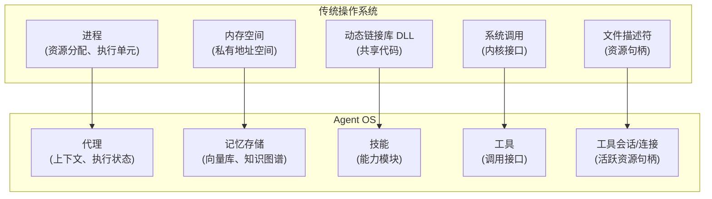
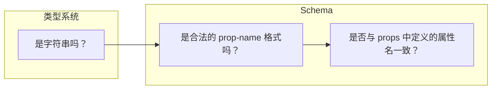
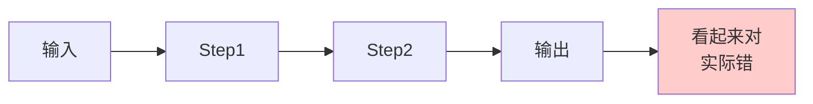
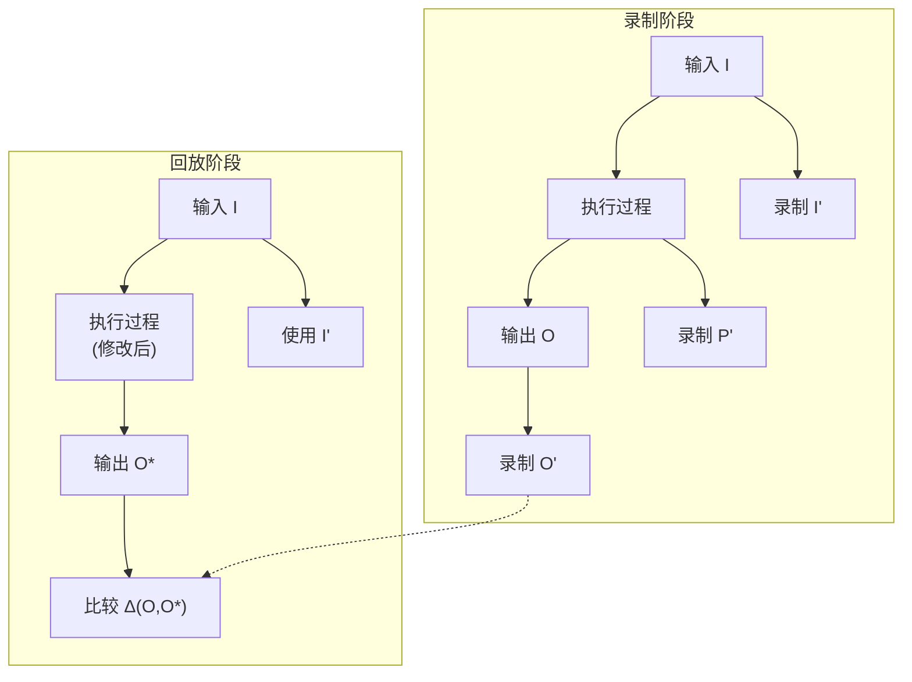

# AI Agent 的演进之路：从对话到自主代理操作系统

## 引言：一个正在发生的范式转移

2026年，我们正站在 AI 发展的一个重要拐点上。当一些系统开始以“Agent Operating System”而非“聊天机器人框架”自我定义（例如最近发布的 [OpenFang](https://www.openfang.sh/)）时，它们共同指向一个更深层的范式转移：**AI 正从“被动响应”进化为“主动工作”**。这不是简单的功能增强，而是从“工具”到“伙伴”的根本性质变——**从“问一句，答一句”的对话机，走向“给目标、交结果”的工作伙伴**。

要理解这个转变，我们需要追溯 AI Agent 的完整演进路径——从最简单的请求-响应，到今天的多代理操作系统，再到未来的**人机深度分工——Agent 自主执行，人类专注于目标设定、关键决策与结果验收的自主运营时代**。

> **核心概念释义**
> 为了阅读清晰，本文使用以下术语：
> 
> - **Skill**：可复用的能力模块（类似操作系统的动态链接库），例如“网页搜索”、“文件读写”等。
> - **Tool**：Agent 可直接调用的标准操作接口（类似操作系统中的系统调用）。
> - **Hands**：OpenFang 中自主运行的 Agent 实例（类似进程），可长期运行、按计划执行任务。
> - **Delta**：声明式的差量定制机制，用于在不修改基础配置的情况下叠加功能或行为。
> - **Plan**：任务执行的蓝图，包含步骤、状态和中间结果，是 Agent 自主工作的核心。

> **术语说明：人机解耦**
> 本文中的“人机解耦”特指交互模式的变化，而非人类退出工作流程：
> 
> - **耦合模式**：人类和 Agent 在相同的时间尺度上工作，每一步都需要实时交互。
> - **解耦模式**：人类和 Agent 在不同的时间尺度上工作，Agent 自主执行子任务，人类定期验收结果、提供反馈、调整方向。
>   类比：耦合模式 = 结对编程（每行代码都一起写）；解耦模式 = Sprint 协作（设定目标后独立开发，定期同步）。解耦解放的是人类的注意力，不是“让人类退出”。

---

## 第一阶段：二元对话时代

### 1.1 Request → Response：孤立的智能瞬间

最初的 LLM 应用是纯粹的**二元系统**：用户提问，AI 回答。没有记忆，没有上下文，每次交互都是独立的孤岛。**那时的智能，是一闪而逝的火花，而不是可以持续燃烧的火堆。**

```
用户 → AI
AI → 用户
```

这个阶段的核心特征：

- **无状态**：每次对话从零开始
- **单轮交互**：问题解决即结束
- **被动触发**：AI 永远等待用户发起

这时的 AI 是一个“智能黑盒”——它拥有知识，但无法累积经验。

### 1.2 Chat：连续对话的出现

Chat 模式的引入打破了孤立性。通过 session 机制，AI 获得了“短期记忆”：**对话第一次从“句子”变成了“故事”。**

```
用户 → AI → 用户 → AI → 用户 → AI ...
      ↑___________↑
        上下文传递
```

但这个阶段仍有一个根本限制：**参与方只有两个**——用户和 AI。所有信息必须在它们之间直接流动。AI 可以“记住”对话历史，但无法“访问”对话之外的世界。

---

## 第二阶段：三方格局的形成

### 2.1 认知基础：从思维链到行动推理

在讨论工具调用之前，我们需要先理解两个奠基性的学术突破：

**Chain-of-Thought (CoT)** — 2022年1月，Google Research 的 Jason Wei 等人发表了论文 [Chain-of-Thought Prompting Elicits Reasoning in Large Language Models](https://arxiv.org/abs/2201.11903)。这篇论文的突破在于：**让 AI “展示工作过程”而非直接给出答案**。

```
传统：问题 → 答案
CoT：  问题 → 思考步骤 → 答案
```

这看似简单的改变，却让 LLM 在复杂推理任务上的表现大幅提升。它揭示了一个深刻的事实：**语言模型需要“思考空间”来展开推理**。

**ReAct** — 2022年10月，Yao 等人发表的 [ReAct: Synergizing Reasoning and Acting in Language Models](https://arxiv.org/abs/2210.03629) 被普遍认为是**定义了现代 AI Agent 时代的开创性论文**。它的核心洞见是：**推理 (Reasoning) 与行动 (Acting) 应该交织进行**。

```
ReAct 循环：
Thought → Action → Observation → Thought → Action → ...
```

这个模式被广泛认为是现代 Agent 架构的奠基性工作之一，对后续的 Agent 系统设计产生了深远影响。

### 2.2 工具调用：机器作为第三方

**Tool Use / Function Calling** 的引入是 Agent 发展的第一个重大飞跃。它引入了一个新的参与方：**机器系统**。

```
    用户
     ↓ ↑
     AI  ←──────→  机器系统
                (工具/API/数据库)
```

这不再是二人对话，而是三方协作。AI 不再仅依靠内部知识回答问题，它可以：**从“会说话”变成“能办事”。**

- 查询实时数据（天气、股价、新闻）
- 执行操作（发邮件、创建文件、调用 API）
- 访问私有数据（企业数据库、个人文档）

### 2.3 函数调用与 Toolformer

值得注意的是，OpenAI 的 Function Calling (2023年6月) 并非凭空出现。早在 2023年2月，Meta AI 的研究人员就发表了 **Toolformer** 论文 ([*Toolformer: Language Models Can Teach Themselves to Use Tools*](https://arxiv.org/abs/2302.04761))，展示了如何让语言模型**自主学习使用工具**。

Toolformer 的创新在于：

- 模型通过 API 调用示例学习何时、如何使用工具
- 不需要大量人工标注
- 工具使用成为模型的“本能”而非外部附加

这预示着未来 Agent 的工具能力可能不再依赖人工设计，而是通过自学习获得。

### 2.4 向 DSL 的演进

函数调用只是开始。真正的趋势是向**领域特定语言（DSL）**演进：**自然语言用来“说清楚想要什么”，DSL 用来“精确地告诉机器要做什么”。**

| 层次  | 表示形式        | 特点             |
| --- | ----------- | -------------- |
| L1  | 自然语言        | 歧义性，适合人-人、人-AI |
| L2  | JSON Schema | 结构化，适合 AI-机器   |
| L3  | DSL         | 领域抽象，表达能力更强    |

**Model Context Protocol (MCP)** 和 **Agent-to-Agent Protocol (A2A)** 是这一趋势的体现。一些前瞻性的系统已经开始将其整合，试图将“工具接入”和“代理互操作”标准化，从而构建一个分层的能力表达体系。

#### 2.4.1 JSON Schema：作为 L2 的“线缆协议”

当前主流的 Function Calling 基本都使用 JSON Schema 来描述参数结构。这是一个非常务实的折中：

- 对模型友好：JSON 结构在预训练语料中极其常见，模型已经“本能地”理解花括号、键值对、数组等模式。
- 对平台友好：JSON Schema 有成熟的校验工具链，便于网关层做基本的结构检查。

但从 Agent OS 的视角看，JSON Schema 更像是一个**L2 级别的“线缆协议”**：

- 它关注的是“**传输时长什么样**”（字段名、类型、必填与否），
- 而较少关心“**在领域内意味着什么**”（跨字段约束、业务不变量、差量合并策略）。

换句话说，JSON Schema 非常适合做：

- L1/L2 语法层的校验（字符串/数字/数组/对象的结构正确性）
- Function Calling 的入参/出参描述（方便网关和 SDK 生成调用代码）

但它并不直接提供：

- DSL 之间的**结构复用**和组合机制（“子语言”如何被引用、嵌套、扩展）
- “同构”的定义/实例关系（定义文件与运行时文档在树结构上的 1:1 对应）
- 面向 Delta/Plan 的差量合并语义（如何稳定定位节点、如何在结构演进下保持补丁可用）

这也是为什么，很多系统在使用 JSON Schema 做 Function Calling 的同时，还要另外维持一套“领域模型”或“配置 DSL”——两边不可避免地出现割裂和重复。

#### 2.4.2 统一元模型：XDef 风格的 L3 设计

要真正让 Agent 在复杂系统里“看懂世界”和“改写世界”，我们有必要在 L3 引入一种**统一的元模型（Meta-Model）**，用来定义各类 DSL 的结构与语义——而不仅仅是函数参数。

一种代表性的做法是Nop平台中**XDef/XDSL** 的设计：

1. **与最终文档同构**：
   
   - 元模型文件（*.xdef）与运行时文档（*.xml）在树形结构上保持一致，
   - 区别只是：定义阶段用“类型标记”占位，运行时用“具体值”填充。

2. **集合语义内建**：
   
   - 通过 `xdef:body-type="list|set|union|map"` 明确子节点集合的语义，
   - 通过 `xdef:key-attr` 定义稳定 key，直接服务于差量合并和快速查找。

3. **结构复用与引用**：
   
   - 用 `xdef:name` 为任意节点命名模型，
   - 用 `xdef:ref` 在同一文件或跨文件复用结构片段，
   - 形成类似“领域内的函数/类型库”。

4. **领域类型与 def-type 语法**：
   
   - 通过 `!string`、`class-name`、`bean-name` 等域特定类型表达业务语义，
   - 远超“仅仅是 string/number”的弱约束。

在这样的设计下，一个 Agent OS 可以：

- 用**同一个元模型**来定义 Plan DSL、工具 DSL、Delta DSL、测试 DSL、权限/策略 DSL 等；
- 让 Agent 看到的是一族“长得很像”的 DSL：树形骨架一致，只是标签名和属性略有差别；
- 在引擎内部，统一使用元模型驱动：
  - 代码/类生成（Plan → 对象模型），
  - 差量计算与合并（Delta → Patch 应用），
  - 录制/回放与行为回归测试（见 5.5 节）。

而面向外部的 JSON Schema Function Calling，只需要看作是这套 L3 元模型的一种**投影**：

- 从 XDef 元模型中自动生成一份精简的 JSON Schema，
- 供模型和 API 网关使用，
- 真正决定语义和演化规则的，仍然是背后的统一元模型。

#### 2.4.3 嵌入式 DSL 与“限域图灵完备”

统一元模型的另一个直接结果是：**DSL 可以自然地被嵌入到对话之中**。

一个典型的 Agent 交互，不再只是自然语言 + 零散的 JSON，而是：

```text
人类：
  用中文给我说明这个 Plan 有哪些风险，并在必要时调整步骤。

Agent：
  （自然语言解释）
  （同时给出一段更新后的 `<plan>` XML/DSL 片段）
```

在这个过程中：

- 自然语言负责表达模糊意图和解释，
- DSL 片段负责承载**可执行的结构化意图**（Plan、Delta、工具调用脚本等）。

为了在保持可检查性的前提下提供足够的表达力，一个常见的设计是：

> **大部分 DSL 保持声明式（Declarative），仅在少数“热点节点”通过 `script` 子节点选择性开放图灵完备能力。**

例如一个基于 XDef 的规则 DSL 片段可以是：

```xml
<rule name="validate-order-amount">
    <condition>
        <script lang="js" sandbox="true">
            <![CDATA[
            // 访问上下文对象，返回 true/false
            const total = ctx.order.items.reduce((s, it) => s + it.price * it.qty, 0);
            return total <= ctx.limits.maxOrderAmount;
            ]]>
        </script>
    </condition>
    <message>订单金额超出限额</message>
    <level>ERROR</level>
</rule>
```

这里的设计要点是：

1. **树是可静态分析的**：
   
   - `rule/condition/message/level` 等节点全部由 XDef 定义，
   - 可以做结构校验、差量合并、录制/回放时的行为比对。

2. **脚本是“限域图灵完备”的叶子节点**：
   
   - 只允许出现在少量特定位置（例如 condition/transform/computed-field），
   - 输入/输出类型由元模型限定（如必须返回 boolean），
   - 在运行时由沙箱执行，便于审计和隔离。

3. **失败检测仍然可以分层进行**（对应 5.5 节）：
   
   - L1/L2：DSL 语法和领域约束由 XDef/Schema 校验，
   - L3：行为差量通过录制/回放框架验证，
   - L4：意图层由人类通过 Plan/Report 验收。

这种“声明式骨架 + 少量可控脚本”的模式，既满足了业务复杂度带来的表达需求，又保留了 Agent 系统在 Plan、Delta、安全审计等方面的**可分析性与可演化性**。

在一个成熟的 Agent OS 中，我们可以预期：

- 对外：仍然可以通过 JSON Schema Function Calling 暴露工具能力，方便生态集成；
- 对内：所有重要的 Plan/Delta/Policy/Test/Tool DSL，都跑在统一的 XDef 式元模型之上；
- 在人机对话中：自然语言 + 嵌入式 DSL 文档片段成为标准协作方式，而不是纯文本聊天。

---

## 2.5 Memory System：从短期记忆到多层级架构

工具调用让 AI 可以访问外部世界，但要真正成为有用的 Agent，还需要**记忆系统**。传统的 Chat 只有短期记忆（context window），现代 Agent 需要多层级 Memory 架构：

### 多层级 Memory 架构

| 层级     | 类型          | 特点                   | 示例            |
| ------ | ----------- | -------------------- | ------------- |
| **L1** | 短期记忆        | Context Window，对话内有效 | “刚才那个”指代上文    |
| **L2** | 长期记忆        | 跨会话持久化，用户偏好          | 记住用户喜欢中文、技术风格 |
| **L3** | 外部记忆        | 向量数据库、知识图谱、RAG       | 查询公司 Wiki、代码库 |
| **L4** | 经验记忆 / 案例记忆 | 任务执行历史、案例库           | 记住上次方案，避免重复错误 |

其中 L1 的 Context Window 本质上是一种**容量受限的工作记忆**，类似于进程的工作集或 CPU 的快速缓存 —— 决定了 Agent 在一次推理中能“带在脑中”的信息上限。

### 实现模式

**传统模式**:

```
用户 → AI (仅依赖 context window)
```

**现代模式**:

```
用户 → AI ←→ 向量数据库 (语义搜索)
            ←→ 知识图谱 (结构化知识)
            ←→ 工具调用 (实时数据)
```

### Memory 的演进意义

Memory System 的完善是 Agent 从“一次性助手”进化为“长期伙伴”的关键：

1. **个性化**：记住用户习惯，提供定制化服务
2. **知识积累**：从经验中学习，不断改进
3. **上下文理解**：理解用户意图的深层含义
4. **任务连续性**：跨会话追踪任务进度

OpenFang 的 Hands 就是典型的例子——它们可以积累知识、构建图谱、追踪准确性。这是“代理为你工作”的基础能力。

---

## 第三阶段：人机融合

### 3.1 将人整合到 Agent Loop

工具调用解决了 AI 与机器的交互，但引入了新问题：**AI 如何在关键时刻获得人的确认？**

传统的做法是让 AI “猜测”用户意图，但这在敏感操作（支付、删除、发送）中风险极高。解决方案是**将人作为 Agent Loop 的一部分**：

```
用户消息 → AI 推理 → [需要确认?]
                           ↓ 是
                      生成 UI 描述 → 用户填写 → AI 继续执行
                           ↓ 否
                      直接执行工具
```

### 3.2 动态 UI：AI 驱动的界面生成

这是一个关键创新：**AI 不再仅返回文本，它可以返回界面描述**。

想象一个场景：用户要求“帮我预订明天去上海的机票”。传统的 AI 可能直接调用 API，但智能的 Agent 会：

1. 识别这是一个敏感操作
2. 生成一个动态表单：航班选择、时间偏好、座位类型
3. 等待用户确认
4. 执行预订

这不是预先设计的 UI，而是**根据上下文动态生成**的交互界面。

**OpenFang 的 Approval Gates** 正是这一模式的体现：

- Browser Hand 在任何购买操作前必须获得用户批准
- 支付、删除、发送等敏感操作触发确认流程
- 通过多种 Channel Adapters 将确认请求发送到用户偏好的平台

值得一提的是，Google 在 2025 年 12 月开源了 **A2UI (Agent-to-User Interface) 协议**，旨在标准化 Agent 动态生成原生 UI 的方式。该协议允许 Agent 发送结构化 JSON 蓝图，由客户端渲染为 native 组件，进一步推动了动态 UI 在智能体系统中的规范化应用。

### 3.3 多模态交互信道

人机融合的另一个维度是**多信道通信**。以 OpenFang 这类系统为例，往往会提供一组 Channel Adapters（覆盖 Telegram、Discord、Email、WhatsApp 等常见渠道）。**Agent 不再住在某一个聊天窗口里，而是像基础设施一样渗透进所有日常工具中。**这意味着：

- **用户可以在任何平台与 Agent 交互**
- **Agent 可以主动推送通知到用户**
- **交互模式可以根据平台特性调整**（Markdown → TelegramHTML → SlackMrkdwn）

---

## 第四阶段：多代理系统与 Agent OS

### 4.1 从单代理到多代理

当我们将视野放大，会发现单个 Agent 的能力有限。复杂任务需要**专业化分工**：

```
        ┌─────────────┐
        │ Orchestrator│ (协调者)
        └──────┬──────┘
       ┌───────┼───────┐
       ↓       ↓       ↓
   Researcher  Coder  Writer
   (研究员)   (程序员) (作者)
```

这就是**多代理系统**的核心思想。**单个 Agent 像一个高手，多个 Agent 才像一支团队。**2023-2025 年涌现了大量框架：

| 框架                      | 核心理念  | 特点                 |
| ----------------------- | ----- | ------------------ |
| **AutoGen** (Microsoft) | 对话式协作 | Agent 之间通过对话协调     |
| **CrewAI**              | 角色分工  | 每个 Agent 有明确的角色和任务 |
| **LangGraph**           | 图状态机  | 用有向图定义 Agent 工作流   |

但它们主要采用**事件驱动架构**，以被动响应为主，缺乏原生的自主调度能力。

### 4.2 学术视角：AIOS 论文

在工业界探索的同时，学术界也在定义 Agent OS 的理论框架。2024年3月，论文 [AIOS: LLM Agent Operating System](https://arxiv.org/abs/2403.16971) 系统性地提出了将 LLM 作为操作系统的“内核”的设想：

```
┌─────────────────────────────────────┐
│         Application Layer           │
│    (Agents, Workflows, Tasks)       │
├─────────────────────────────────────┤
│         AIOS Kernel Services        │
│  ┌─────────────────────────────┐    │
│  │ LLM as OS Kernel            │    │
│  │ • Scheduling & Context Mgmt │    │
│  │ • Memory Management         │    │
│  │ • Tool Registry             │    │
│  │ • Inter-Agent Communication │    │
│  └─────────────────────────────┘    │
├─────────────────────────────────────┤
│         Hardware/Infrastructure     │
└─────────────────────────────────────┘
```

AIOS 论文的贡献在于：它从操作系统原理出发，系统性地定义了 Agent OS 应该具备的核心服务——调度、内存管理、工具注册、代理间通信。这与传统操作系统的设计高度吻合。**当 Agent 多到需要“内核服务”来管理时，我们就真的在和一个新物种级别的计算平台打交道了。**

### 4.3 一种新的理解视角：Agent OS 作为真正的操作系统

**这里我想提出一种理解 Agent OS 的新视角：**（注：这是本文作者提出的理解框架，而非任何现有系统的官方定义）



#### 进程概念的四个核心维度

操作系统中进程（Process）的定义是**正在执行的程序**，它包含四个核心维度：

##### 1. 资源分配单元

**操作系统**：进程是资源分配的基本单位。每个进程拥有：

- CPU 时间片（由调度器分配）
- 内存空间（通过虚拟内存管理）
- 文件描述符（打开的文件、套接字）

**Agent OS 对应**：Agent 是资源分配的基本单位

- **Context Window** = 进程工作集 / CPU 缓存（有限的即时工作记忆容量）
- **Memory Store** = 虚拟内存 / 统一记忆空间（其背后由 RAM、磁盘、向量库、知识图谱等多级存储共同支撑）
- **活跃连接池** = 打开文件表（当前持有的外部资源）
- **执行时长配额 / 调用频率** = CPU 时间片（由调度器分配）

> **关于文件描述符的精确类比**
> 初看之下，“Tool = 文件描述符”似乎合理，但深入分析会发现这不够精确：Tool 定义更像“系统调用接口规范”，描述了“可以做什么”；而“工具会话”（已建立的连接实例）才对应文件描述符——它是当前持有的资源句柄。因此：
> 
> - **系统调用**（如 `read`）对应 **Tool 定义 + 调用**
> - **文件描述符**（如 `fd=3`）对应 **工具会话/连接**（有状态的资源句柄）
> - **打开文件表**对应 **活跃连接池**（当前持有的外部资源集合）

---

##### 2. 执行单元

**操作系统**：进程是调度的基本单位。每个进程拥有：

- 程序计数器（PC）—— 指向当前执行的指令
- 寄存器组 —— 保存当前计算状态
- 栈 —— 保存函数调用链

**Agent OS 对应**：Agent 是执行的基本单位

- **当前任务** = 程序计数器（正在执行的目标）
- **工作记忆** = 寄存器组（当前推理状态）
- **执行历史** = 栈（任务调用链）

##### 3. 信息隐藏空间

**操作系统**：进程拥有私有地址空间

- 每个进程看到的是独立的虚拟地址空间
- 一个进程不能直接访问另一个进程的内存
- 必须通过 IPC（进程间通信）才能交换数据

**Agent OS 对应**：Agent 拥有私有上下文空间

- 每个 Agent 有独立的对话历史和知识状态
- 一个 Agent 不能直接访问另一个 Agent 的内部状态
- 必须通过 A2A/MCP 协议才能通信

##### 4. 隔离机制

**操作系统**：通过虚拟内存和特权级实现隔离

- 用户态 vs 内核态 —— 危险操作需要系统调用
- 虚拟内存 —— 进程间内存隔离
- 命名空间 —— 资源视图隔离（容器技术）

**Agent OS 对应**：通过能力系统和沙箱实现隔离

- **用户态 vs 内核态** = 普通工具 vs 敏感操作（需要 Approval Gate）
- **虚拟内存** = Agent 状态隔离（一个 Agent 的错误不影响其他 Agent）
- **命名空间** = 多租户隔离（不同用户的 Agent 相互不可见）

---

**这个类比的核心洞见是：Skill 作为共享能力库。**

传统操作系统中，多个进程可以加载同一个 DLL：

```
Process A ──┐
            ├──→ shared.dll
Process B ──┘
```

在 Agent OS 中，多个 Agent 可以共享同一个 Skill：

```toml
# Agent A (researcher)
[capabilities]
tools = ["web_search", "web_fetch", "github"]

# Agent B (coder)
[capabilities]
tools = ["file_read", "file_write", "github", "docker"]
```

`github` skill 被两个 Agent 共享。就像 DLL 被多个进程加载一样。

有趣的是，AIOS 论文也提出了类似的观点：Agent OS 应该提供类似传统 OS 的内核服务。这或许说明，**当一个系统足够复杂时，它会不可避免地重新发明操作系统的核心概念**。

### 4.4 尚未充分体现的操作系统概念

当我们将 Agent OS 与传统操作系统类比时，会发现许多成熟概念尚未体现。这些缺失指明了演进方向。

**信号机制**：OS用信号实现异步中断，进程可捕获并优雅处理。Agent OS 缺乏类似机制——执行长任务的 Agent 无法被优雅中断，只能强制停止，导致状态丢失。  
*演进方向*：Agent 可注册中断处理函数，收到中断时保存任务状态以便恢复。

**僵尸回收**：OS中子进程退出后进入“僵尸状态”，保留退出码等待父进程读取，之后才释放资源。Agent OS 中，子 Agent 完成任务后资源可能未被及时回收。  
*演进方向*：引入类似 `wait()` 机制，主 Agent 获取结果后系统自动回收子 Agent 资源。

**死锁检测**：OS中多个进程循环等待资源时，系统可检测死锁。Agent OS 中可能形成循环依赖（A 等 B 的结果，B 等 A 的确认）。  
*演进方向*：维护依赖图，检测循环等待并触发恢复策略。

**检查点**：数据库使用检查点实现故障恢复。Agent 长任务遇故障时目前往往从头开始，造成浪费。  
*演进方向*：关键步骤前自动保存检查点，失败时从检查点恢复。（Plan机制实现了某种轻量级的检查点，详见4.5节“Plan的检查点与恢复机制”。）

**资源配额**：OS通过 cgroups 限制进程的 CPU、内存等资源使用。Agent OS 中多租户如何公平分配 LLM 调用、计算、存储、网络等各类资源？
*演进方向*：为每个 Agent 分配 token 预算、API 频率上限、内存限制、磁盘配额、执行时长等，结合优先级调度，实现全面的资源公平调度与隔离。

**内存换页（Context 管理）**：OS将不活跃内存页换出到磁盘。Agent 对话历史超过 Context Window 时，如何“换出”早期内容？  
*演进方向*：将早期对话摘要存储到向量数据库，需要时检索召回（语义化换页）。

**写时复制（CoW）**：OS 中 `fork()` 创建子进程时共享内存，仅写入时才复制。克隆 Agent 时可共享知识库，修改时才复制。  
*演进方向*：克隆时共享底层向量存储，仅在修改时创建私有副本。

这些概念的缺失，说明当前 Agent OS 仍处于“早期 Unix”阶段——核心功能已具备，但系统级的成熟机制仍在演进中。

### 4.5 Plan：从“工作流定义”到“自我规划-执行-自检”的执行蓝图

要理解 Agent 如何自主执行复杂任务，我们必须引入其核心机制：**Plan（计划）**。**没有 Plan 的 Agent，只是在“聪明地即兴发挥”；有了 Plan 的 Agent，才有可能“系统地负责到底”。**

与传统技术（如BPM、CI/CD）中由人预先定义的静态工作流不同，Agent 的 Plan 是一个**动态的、自我驱动的执行蓝图**。其关键差异在于 Agent 能够围绕 Plan 形成一个完整的自主闭环：

> **Plan → Execute → Check → Re-plan** (规划 → 执行 → 自检 → 重规划)

这个闭环意味着 Agent 可以：

- **自主规划 (Plan)**：将模糊的人类目标分解为清晰、可执行的步骤。
- **自主执行 (Execute)**：按计划调用工具，推进任务，并记录过程。
- **自主检查 (Check)**：对照预设的验收标准，检验每一步的结果。
- **自主调整 (Re-plan)**：当发现偏差或遇到新情况时，动态修改计划。

因此，Plan 不再是一张静态的流程图，而更像一份 Agent 的**“执行合约”与“运行时状态”**的结合体，是其实现自主工作的关键。**对人类来说，Plan 是一张“看懂机器在干什么”的窗口；对 Agent 来说，Plan 是一张“记住自己承诺了什么”的清单。**

#### Plan 在 Agent 架构中的位置

Plan 是一种特殊的任务表示形式——它是**展开的执行轨迹**，内嵌进度标记。在一个典型的 Agent 会话中，通常会包含：

```
Session（会话）
├── session.json        # 消息历史
├── plan.xml            # 任务计划和进度 ← Plan 在这里
├── out-{timestamp}.log # 工具执行日志
└── history-{snapshot}.json # 历史快照
```

**Plan 的一种可能定义**（以 XML 为例）：

```xml
<plan title="研究用户需求">
    <steps>
        <step name="collect_requirements" title="收集需求" status="completed">
            <note>已收集5个核心需求点</note>
        </step>
        <step name="analyze_feasibility" title="分析可行性" status="in_progress">
            <note>正在评估技术方案</note>
        </step>
        <step name="design_solution" title="设计方案" status="not_started"/>
        <step name="implement" title="实现" status="not_started"/>
        <step name="verify" title="验证" status="not_started"/>
    </steps>
</plan>
```

#### Plan 与 OS 调度的对比

| 维度      | OS 调度/作业管理     | Agent Plan  |
| ------- | -------------- | ----------- |
| **目标**  | 资源利用率、公平性      | 任务完成、目标达成   |
| **输入**  | 队列长度、优先级、资源状态  | 自然语言目标、环境状态 |
| **适应性** | 静态策略（CFS、实时调度） | 动态重新规划      |
| **语义**  | 无（纯数学优化）       | 语义理解、常识推理   |
| **粒度**  | CPU 时间片、内存页    | 任务步骤、子目标    |

**核心区别**：

- **OS 调度**解决“如何高效执行已知任务”
- **Agent Plan**解决“应该做什么、为什么做、何时做”

#### 为什么 Agent 需要 Plan？

**① “Rush to Response” 问题**
LLM 默认立即生成答案，导致幻觉或不完整回答。复杂任务必须先规划后行动。

**② 推理 ≠ 规划**
推理是步骤式思考，规划是前瞻性目标导向。研究表明：推理失败的根本原因是贪婪局部最优选择在长视界中被放大。

**③ 保持一致性**
Nop AI 通过 `ConsistencyChecker` Agent 检查 Plan 与 Chat 的一致性，确保执行不偏离计划。

#### Plan 的检查点与恢复机制

当 Agent 执行过程中断（网络故障、超时、资源不足）时，Plan 记录了“执行到哪里”，使得恢复后可以从断点继续，而非从头开始。

**与 PCB 的类比**：

| PCB 组件        | PCB 内容                | Agent Plan 对应                 | 说明                                                                 |
| ------------- | --------------------- | ----------------------------- | ------------------------------------------------------------------ |
| **PID**       | 进程标识                  | Plan ID                       | 唯一标识任务                                                             |
| **State**     | RUNNING/READY/BLOCKED | step.status                   | 当前状态                                                               |
| **PC**        | 程序计数器                 | `<step status="in_progress">` | 执行到哪里                                                              |
| **Registers** | 通用寄存器                 | `<note>`                      | 中间结果（示意性类比：寄存器是 CPU 内部的瞬时状态，而 `<note>` 更像是被主动持久化的一小块中间结果，用于检查点与恢复） |
| **Stack**     | 调用栈                   | 步骤依赖关系                        | 执行上下文                                                              |

#### Plan 作为人机深度分工的契约

Plan 不仅是执行蓝图，更是**人类意图与机器执行之间的契约**。但这个契约不是一次性签订的静态合约，而是一个**动态对齐过程**。

##### 现实挑战：意图表达的有损性

在实践中，Plan 面临三个根本性约束：

1. **意图模糊性**：人类往往无法清晰表达真实目标。"做一个好用的搜索功能"——什么是"好用"？响应快？结果准？交互流畅？这些维度可能相互矛盾。

2. **分解有损性**：高层次目标转化为步骤时必然丢失信息。"优化性能"分解为"加缓存"、"建索引"、"异步处理"——但哪一个是瓶颈？优先级如何？分解本身就需要领域知识，而这个知识可能正是人类想要委托给 Agent 的。

3. **验收标准的递归问题**：如果人类能精确定义"什么是完成"，那任务本身可能已经足够明确，不需要 Agent 来规划。**越是需要 Agent 规划的任务，人类越难给出精确验收标准**。

##### 演进路径：从"对齐工具"到"框架约束下的自动化"

Plan 的角色会随着系统能力成熟度而演进：

**阶段一：人机对齐工具（当前）**

```
人类模糊目标 → Agent 生成 Plan 草案 → 人类阅读、修改、确认 → 执行
                    ↑                           ↓
                    └──── 过程中持续校准 ←───────┘
```

此时 Plan 的核心价值是**让人类看见 Agent 的理解**，在执行前校准。这不是"契约签订"，而是"对齐对话"。

**阶段二：框架约束下的自动化（中期）**

人类不再逐条审核 Plan，而是提供**约束框架**：

```yaml
# 人类提供的框架
goal: "重构支付模块"
constraints:
  - 保持 API 向后兼容
  - 测试覆盖率不低于 80%
  - 不引入新的外部依赖

gates:  # 关键门限点——必须人类确认
  - 设计方案确定后
  - 涉及数据迁移前
  - 上线部署前

auto_proceed: true  # 门限点之间自动执行
```

Agent 在框架内自主规划和执行，只在**门限点**暂停等待人类硬性验收。

**阶段三：信任积累后的全自动化（远期）**

当 Agent 在特定领域积累了足够的成功案例和信任记录后，人类可以逐步放宽门限点：

```
初期：每 3 个步骤设一个门限
中期：只在关键决策点设门限（设计变更、资源申请、外部交互）
成熟期：只在最终验收设门限，中间过程完全自主
```

这种**渐进式授权**类似员工晋升——新人每步都要汇报，资深员工只在关键节点请示，专家可以独立完成整个项目。

##### 门限点设计：硬标准与软提示

门限点是 Plan 契约化的关键机制。一个门限点包含：

| 组件       | 说明         | 示例                            |
| -------- | ---------- | ----------------------------- |
| **触发条件** | 何时触发门限     | 执行到步骤 N / 检测到特定操作类型 / 资源消耗超阈值 |
| **硬标准**  | 必须满足的客观条件  | "测试通过率 100%"、"预算不超过 $500"     |
| **软提示**  | 给人类参考的判断维度 | "请关注：是否有更简单的方案？"              |
| **超时策略** | 人类未响应时的行为  | 等待 / 降级执行 / 回滚 / 上报           |

```
门限点示例：
┌─────────────────────────────────────────┐
│ ⚠️ 门限点：数据库迁移方案确认               │
├─────────────────────────────────────────┤
│ 硬标准：                                 │
│  ✓ 回滚脚本已生成                        │
│  ✓ 预估停机时间 < 10 分钟                │
│  ✓ 已在 staging 环境验证                 │
├─────────────────────────────────────────┤
│ 软提示：                                 │
│ • 是否有不停机迁移的方案？                  │
│ • 迁移窗口是否避开业务高峰？                │
├─────────────────────────────────────────┤
│ [批准] [拒绝并重新规划] [查看详细方案]       │
└─────────────────────────────────────────┘
```

##### 契约的真正含义

Plan 作为契约，其含义是：

- **框架约束**：人类设定边界（目标、约束、门限点），Agent 在边界内自主
- **渐进授权**：信任随成功案例积累，门限点逐步减少
- **可审计性**：Plan 记录了 Agent 的"承诺"，执行结果可以对照验收
- **失败责任划分**：如果 Agent 违反 Plan 执行，责任在 Agent；如果 Plan 本身有缺陷，责任在人类对齐不充分

**Plan 不是"一次性签名的合同"，而是"持续校准的协作框架"**。它的核心价值不在于"精确描述未来"，而在于"让双方对'正在做什么'保持同步理解"。

---

### 4.6 一个 Agent OS 的实现案例

一个具体的 Agent OS 实现，其架构可能包含以下组件（此为概念示意，用于帮助理解这类系统如何组织功能）：

```
┌──────────────────────────────────────────────┐
│              Agent OS Kernel                 │
├──────────────────────────────────────────────┤
│  Registry | Scheduler | Capabilities | Events│
├──────────┬──────────┬──────────┬─────────────┤
│ Agent 1  │ Agent 2  │ Agent 3  │   ...       │
├──────────┴──────────┴──────────┴─────────────┤
│  Skills (shareable)                          │
├──────────────────────────────────────────────┤
│  Channels (adapters)                         │
└──────────────────────────────────────────────┘
```

这类系统在产品表达上，可能会强调“可长期运行、可按计划调度”的代理实例，从而把 Agent 从事件驱动的被动响应，推向时间驱动的持续工作。

### 4.7 自主代理：不再等待用户

这类系统最独特的创新之一是**自主代理**——能够独立运行的代理包。

传统的 Agent 框架是**事件驱动**的：用户触发 → Agent 执行 → 等待下一次触发。

自主代理可以是**时间驱动**的：

```bash
# 示例：设置一个代理每天早上 6 点自动运行
agentctl hand activate lead --schedule "0 6 * * *"

# 它可能会：
# 1. 发现潜在客户
# 2. 丰富客户信息
# 3. 评分 (0-100)
# 4. 去重
# 5. 推送到 CRM
# 6. 发送通知
```

这是**“代理为你工作”**而非**“你使用代理”**。

### 4.8 面向差量的 Agent 架构

当我们把**操作系统的进程概念**和**声明式的差量架构**放在同一张图里看，会出现一个很“工程师直觉”的问题：**Agent 能不能像软件产品线一样被差量化组装，并且在运行时差量化试错？**

这里的关键不是“又一种配置覆盖”，而是一种更强的变更语言：**可组合、可回滚、可审计**。

#### 4.8.1 Delta 是什么：不是覆盖，是“变更”

**差量（Delta）**是一种**声明式增量修改描述**：它描述“在基础之上添加/修改/删除什么”，而不是拿一份新配置把旧配置拍扁。**配置文件在陈述“状态”，Delta 在陈述“修改”。**

从代数角度看，它满足一种非常实用的结构（你不需要把它当数学炫技，它对应的是工程里的“可组合”和“可撤销”）：

- **可组合**：Delta ⊕ Delta 仍然是 Delta
- **可叠加**：顺序叠加得到最终结果
- **可撤销**：存在“逆 Delta”，可以把一次尝试完整还原

```
最终应用 = BaseProduct ⊕ Delta1 ⊕ Delta2 ⊕ ... ⊕ DeltaN
```

**快照只能告诉你“结果变成了什么”，Delta 才能告诉你“是怎么走到这一步的”。**

#### 4.8.2 静态层：差量化组装 Agent（像组装产品一样组装角色）

先从最朴素的用法开始：用 Delta 快速定制 Agent 变体。

```java
// 运行时根据上下文动态组装 Agent（示意伪代码）
Agent agent = AgentBuilder.create("researcher")
    .withDelta("security-focused")   // 增加安全检查习惯
    .withDelta("chinese-language")   // 增加中文输出与本地语境
    .build();
```

这让“同一个基础 Agent”可以长出很多面向场景的变体：多租户、多团队、多目标切换都更轻。

#### 4.8.3 语义层：树形 Delta，比行级 diff 更像“外科手术”

Delta 的威力不只在“叠加”，还在“作用点足够精确”。

- **行空间 diff**（例如按行号的文本 patch）不理解语义：格式变化、自动格式化、换行都可能把它搞崩。
- **树形结构 Delta**（按树路径 / JSON Pointer / XPath / AST）理解结构：插入、重排不改变语义路径时，Delta 仍然稳。

**diff 关注的是“文本怎么变”，Delta 关注的是“结构和语义怎么变”。**

这意味着 Agent 修改配置、代码、文档时，可以更接近“结构化外科手术”，而不是大段替换文本。

#### 4.8.4 动态层：把失败留在分支里，把成功带回主线

真正有趣的地方在运行时：Delta 让 Agent 可以在“想象空间”里试错。

核心机制很简单：**Session 内置快照与分支**。

- **快照**：风险操作前先存一份可恢复状态
- **分支**：从快照上 fork 出一条修复分支，允许连续失败
- **回流**：只把“成功那次尝试产生的 Delta”合并回主线

```
主线(Main): Step1(成功) → Step2(成功) → Step3(调用Tool-X) → [失败]
                     ↓
                分支(Fix): 调参/重试 → [失败]
                     ↓
                分支(Fix): 换Tool-Y → [成功]
                     ↓
主线(Main): Step1(成功) → Step2(成功) → Step3(成功) → Step4...
```

这个设计的洞见是：**让系统保留“尝试能力”，但不强迫人类阅读“失败噪声”。**
主线像一条干净的审计路径；分支像后台的试错草稿纸。

#### 4.8.5 决策层：平行宇宙不是比喻，是一种工程策略

当不确定性来自“选哪条路”，最稳的做法不是让 LLM 靠直觉拍一个答案，而是并行跑几条路再选。

- 分支 1：财务视角（会计/报表工具）
- 分支 2：市场视角（舆情/竞品工具）
- 分支 3：技术视角（专利/工程工具）

最后由聚合器（Meta-Agent）或人类做一次判断：保留哪条、融合哪些。

#### 4.8.6 交互含义：把“对话微操”升级为“声明式指导”

当你同时管理多个并行 Agent 时，细粒度对话会把人拖回耦合模式。Delta 可以自然演进成一种人类指导语言：**把“单个 Agent 的对话指令”，提升为“整片 Agent 群体的行为调整”。**

```delta
apply delta "focus-china" to agents [researcher-*, analyst-*]
apply delta "add-citation-requirement" to agent researcher-3
```

这不是为了“像配置一样好看”，而是为了把人机协作从“盯步骤”升级为“定方向 + 设验收”。

---

## 第五阶段：安全与信任

### 5.1 多层防御体系

自主代理带来了前所未有的安全挑战。一个典型的 Agent OS 实现，常见做法是把安全拆成多层“防线”（这里列的是一种代表性实现的分层清单）：

| 层次  | 机制             | 防护目标       |
| --- | -------------- | ---------- |
| 1   | WASM 双重计量沙箱    | 防止失控代码     |
| 2   | Merkle 哈希链审计   | 防篡改日志      |
| 3   | 信息流污点追踪        | 敏感数据追踪     |
| 4   | Ed25519 签名清单   | 身份验证       |
| 5   | SSRF 防护        | 防止内网攻击     |
| 6   | 秘密清零           | API 密钥自动擦除 |
| 7   | OFP 互认证        | P2P 安全     |
| 8   | 能力门控           | 权限控制       |
| 9   | 安全头 (CSP等)     | Web 安全     |
| 10  | 健康端点脱敏         | 信息泄露防护     |
| 11  | 子进程沙箱          | 进程隔离       |
| 12  | Prompt 注入扫描    | 输入安全       |
| 13  | Loop Guard     | 循环检测       |
| 14  | Session Repair | 状态恢复       |
| 15  | 路径遍历防护         | 文件系统安全     |
| 16  | GCRA 速率限制      | DoS 防护     |

这不仅是“安全功能列表”，而是**一个完整的信任架构**。

### 5.2 能力继承验证

在多代理系统中，一个关键问题是**权限传递**：Agent A 创建 Agent B 时，B 能否获得比 A 更高的权限？

一种典型答案是：**否**。例如通过类似 `validate_capability_inheritance()` 的检查，确保子代理永远不会越过父代理的权限边界。

### 5.3 审批门控

敏感操作必须经过人类确认：

- Browser Hand 的购买操作
- Twitter Hand 的发布操作
- 任何涉及数据删除的操作

这是**将人作为最终安全边界**的设计哲学。

### 5.4 面向自主运营的信任架构

当 Agent 进入“人机异步协作”的自主运营时代，人类长时间缺席，安全机制需要从“实时防护”转向“事后审计 + 异常上报”。这就要求在现有防御体系之上增加：

- **结果可信度验证**：每个结论必须附带证据链、置信度、信息来源，便于人类快速判断。例如，研究 Agent 提交的报告应自动生成“可信度评分”，低可信部分高亮标注。
- **异常主动上报**：Agent 遇到无法处理的情况（如目标冲突、疑似攻击、成本超支）时，应主动暂停并上报人类，而不是继续盲目执行。
- **审计日志的可读性**：为人类验收提供摘要版执行报告，而非原始日志。得益于 Delta 的“只保留成功路径”机制（见 4.8.4），自主运营中 Agent 在后台的无数次失败尝试不会干扰人类对最终结果的审查，人类看到的是一份经过“蒸馏”的干净执行报告。
- **多 Agent 间的信任传递**：当 Agent A 调用 Agent B 时，系统需确保 B 的权限不会超出 A 的授权范围，并记录完整的调用链，以便在出现问题时追溯责任。

这种架构将人类从“实时监控者”转变为“抽样审计者”，在保证安全的同时释放人类注意力。

### 5.5 失败检测与纠正：从语法到语义的分层检测

前面我们讨论了多种失败处理机制：

- **4.8.4 动态层**：通过分支试错，"把失败留在分支里，把成功带回主线"
- **5.4 信任架构**：异常主动上报、审计日志、结果可信度验证

这些机制的共同前提是：**我们能够识别什么是失败**。

然而，Agent 的失败不像传统软件那样有明确的错误码或异常。一个执行可能：

- **语法正确但语义偏离**：返回了符合 Schema 的 JSON，但内容与目标无关
- **过程正确但结果错误**：每一步都合理，但最终结论是错的
- **形式完整但意图未达成**：任务"完成"了，但用户的真实需求没有被满足

这意味着失败检测本身需要**分层**——不同层面的失败需要不同的检测机制。我们可以将失败区分为**语法层面**和**语义层面**两个维度。

#### 5.5.1 语法层面的失败检测

语法层面的失败是**可自动判定的**。主要包括：

| 检测类型          | 机制     | 示例                     |
| ------------- | ------ | ---------------------- |
| **Schema 校验** | 结构化约束  | JSON Schema、XML Schema |
| **DSL 语法检查**  | 领域语言规则 | 查询语法、配置语法              |
| **类型系统检查**    | 静态类型约束 | TypeScript、Java 类型     |

##### Schema vs 类型系统：领域语义的优势

> **术语说明**：本文中的 “Schema” 并不特指 JSON Schema，而是泛指“可机器校验的领域契约”。

传统类型系统的约束是**全局的、固定的**，由语言设计者预设。但 Agent 系统往往需要**领域特定的局部校验规则**。

例如，一个字段必须满足 `prop-name` 格式，且必须与 `props` 中定义的属性名称一致。这种**跨字段的语义约束**，传统类型系统难以表达。

Schema 的核心优势在于：

- **可定制性**：领域专家可以定义自己的校验规则
- **局部性**：规则可以针对特定上下文，而非全局统一
- **语义感知**：可以表达"这个值必须是那个列表中的一项"等引用关系



这表明 Agent 系统需要的是**领域语义感知的校验**，而非通用的类型安全。

#### 5.5.2 语义层面的失败检测

语义层面的失败是**形式正确但意图偏离**。这类失败无法通过静态检查发现，必须通过**运行时推演**来验证。



##### 推演结果一致性

“推演”要可自动化，必须依赖三类输入：

1) **领域语义（Schema/元模型）**：定义合法状态空间与不变量；
2) **可回放的上下文（输入与状态快照）**：保证同一推演可重复；
3) **可审计的过程表示（Plan/Trace）**：让系统能解释“为何得到该输出”。

推演一致性检查的价值在于：它把“形式正确但意图偏离”这类问题，从主观判断转为可对比的差量。

语义检查的核心是：**根据已有语义自动推演，然后检查推演结果是否一致**。

典型的实现方式包括：

1. **单元测试**：定义输入和预期输出，验证 Agent 行为
2. **集成测试**：验证多 Agent 协作的整体行为
3. **领域不变量**：检查系统状态是否满足业务规则

##### 录制/回放 + 差量分析

Nop 平台提供了**录制/回放的自动化测试机制**，通过观察调整后产生的录制结果的差量来逐步修正处理过程：



这种方法的核心不是判断"对错"，而是**比较差量**：

```
理想情况：Δ(O, O*) = ∅ （无变化，修改安全）
预期变化：Δ(O, O*) = { "fieldA": "old" → "new" } （预期修改）
异常漂移：Δ(O, O*) = { "fieldA": ..., "fieldB": ..., "fieldC": ... } （意外修改过多）
```

推演结果的差量展现和比较，让人类可以快速定位"哪里变了"，判断变化是否符合预期。

#### 5.5.3 差量认知与差量应用

录制/回放中的差量分析，体现了 Agent 系统的一个设计原则：

> **给 AI 提供以差量形式来认知世界的认知工具，也需要给它们以差量形式来介入世界的作用方式。**

##### 差量认知

从信息论角度，**信息 = 不确定性消除 = 惊讶度**：

```
绝对状态："房间温度是 23°C"        → 信息量：低（如果我知道大概是 22°C）
差量信息："房间温度从 20°C 升到 23°C" → 信息量：高（变化意味着事件）
```

AI 的认知带宽是有限的。让它处理"全量状态"是浪费；让它处理"差量"才是高效。

**传统方式**：AI 看到的是"快照"

```json
// 时间 T1: { "system": { "cpu": 45, "memory": 60 } }
// 时间 T2: { "system": { "cpu": 78, "memory": 62 } }
// AI 需要自己比较，才知道"什么变了"
```

**差量方式**：AI 看到的是"变化流"

```json
{
  "delta": {
    "system.cpu": { "old": 45, "new": 78, "change": "+33" }
  },
  "significance": "high"
}
```

##### 差量应用

不仅认知是差量的，行动也应该是差量的。

**命令式（传统）**：

```
AI: "把配置文件改成这样：{ ... 完整的新配置 ... }"
```

问题：需要知道完整的目标状态，容易覆盖其他修改，难以回滚，难以审计。

**差量式**：

```
AI: "在配置文件中：添加字段 X = Y，修改字段 A 从 old 到 new"
```

优势：只表达"意图的变化"，可以和其他差量组合，可以回滚，天然可审计。

##### 差量与全量的转换

差量和全量是可以**自动转换**的：

```
全量 → 差量：δ = S₂ - S₁（两个全量状态可以计算出差量）
差量 → 全量：S₂ = S₁ + δ（一个全量加上差量得到新全量）
```

这意味着存储策略可以灵活选择。**但如果要保存修改意图，差量化存储就很重要**——因为意图无法从两个全量状态中自动推断。

```typescript
interface IntentfulDelta {
  changes: DeltaChange[];

  // 意图信息（无法自动推断）
  intent: {
    goal: string;           // "优化数据库性能"
    reasoning: string;      // "增加连接池大小可以减少连接创建开销"
  };

  metadata: {
    author: AgentIdentity;
    timestamp: Date;
    context: ExecutionContext;
  };
}
```

#### 5.5.4 分层失败检测框架

综合语法和语义两个层面，可以构建一个完整的失败检测框架：

```
┌─────────────────────────────────────────────────────────────┐
│ L4: 意图层 (Intent Alignment)                                │
│     • 目标是否达成？                                          │
│     • 结果是否有价值？                                        │
│     → 判定：人类最终验收（参考意图记录）                         │
├─────────────────────────────────────────────────────────────┤
│ L3: 语义层 - 行为一致性 (Behavioral Consistency)              │
│     • 录制/回放差量检查                                       │
│     • 单元测试/集成测试                                       │
│     • 领域不变量验证                                          │
│     → 判定：自动化 + 人类确认异常                              │
├─────────────────────────────────────────────────────────────┤
│ L2: 语义层 - 领域约束 (Domain Constraints)                    │
│     • Schema 领域规则校验                                     │
│     • 跨字段引用一致性                                         │
│     • 业务规则校验                                            │
│     → 判定：完全自动化                                        │
├─────────────────────────────────────────────────────────────┤
│ L1: 语法层 (Syntax Validation)                               │
│     • JSON/XML 结构校验                                      │
│     • DSL 语法检查                                           │
│     • 基础类型检查                                            │
│     → 判定：完全自动化                                        │
└─────────────────────────────────────────────────────────────┘
```

各层级的特征：

| 层级       | 失败特征 | 检测成本 | 修复策略 |
| -------- | ---- | ---- | ---- |
| L1 语法    | 结构错误 | 极低   | 语法修正 |
| L2 领域约束  | 规则违反 | 低    | 规则对齐 |
| L3 行为一致性 | 输出偏离 | 中    | 差量分析 |
| L4 意图对齐  | 目标误解 | 高    | 目标澄清 |

**差量分析的价值**：L3 层的"差量分析"是连接"自动化检测"和"人类判断"的桥梁。它不是简单地判断"对错"，而是展现"变化"，让人类可以快速理解 Agent 行为的偏离程度和方向。

---

## 第六阶段：协议与互操作

### 6.1 MCP：工具的 USB-C

**Model Context Protocol (MCP)** 旨在成为 AI 工具连接的通用标准。

在 MCP 之前：

- M 个 AI 系统 × N 个工具 = M × N 个集成

在 MCP 之后：

- M 个 AI 系统 + N 个 MCP 服务器 = M + N 个连接

一个 Agent OS 可以同时实现 MCP Client 和 MCP Server：

- **Client**：连接外部 MCP 服务器，扩展工具能力
- **Server**：将自身的内置工具集暴露给其他 AI 系统

### 6.2 A2A：代理间的通用语言

**Agent-to-Agent Protocol (A2A)** 则试图解决另一个问题：**不同框架的代理如何互操作？**

A2A 的核心概念：

- **AgentCard**：代理的“名片”，声明能力和端点
- **Task**：代理间协作的任务单元
- **Opaque Interaction**：代理不需要暴露内部状态

```
┌─────────────┐     A2A Protocol    ┌─────────────┐
│ Agent OS A  │ ←─────────────────→ │ Framework B │
│ (OpenFang)  │                     │ (LangGraph) │
└─────────────┘                     └─────────────┘
```

通过实现 A2A 协议，一个 Agent OS 可以处理相关任务端点，并与任何 A2A 兼容系统协作。

---

## 第七阶段：自主运营时代——人机异步协作

当协议标准化、Agent OS 成熟、Plan 成为可靠契约后，我们将迎来 AI Agent 演进的第七阶段：**自主运营时代**。这一阶段的标志是**人机异步协作——人类专注于目标设定与结果验收，Agent 在人类不需要实时在线的情况下持续工作**。

### 7.1 从“人机耦合”到“人机异步协作”

| 维度       | 人机融合阶段（阶段3）              | 自主运营阶段（阶段7）              |
| -------- | ------------------------ | ------------------------ |
| **交互方式** | 同步、实时、对话式                | 异步、任务式、结果导向              |
| **主控权**  | 人类在环内（Human-in-the-loop） | 人类在环上（Human-on-the-loop） |
| **时间关系** | 人类等待 Agent，Agent 等待人类    | Agent 可在人类离线时持续工作，人类按需介入 |
| **交互粒度** | 细粒度指令（“下一步做什么”）          | 粗粒度目标（“完成什么”）            |
| **人类角色** | 实时操作者、每步确认者              | 目标设定者、关键决策者、结果验收者        |
| **人类瓶颈** | 注意力                      | 判断力                      |

> **需要澄清的是**，“人机解耦”不是指人类退出工作流程，而是指交互模式的根本性变化：
> 
> - **耦合模式**：人类和 Agent 在相同的时间尺度上工作，每一步都需要实时交互。人类的注意力成为瓶颈——一个人只能同时关注 1-2 个 Agent。
> - **解耦模式**：人类和 Agent 在不同的时间尺度上工作。Agent 自主执行子任务，人类定期验收结果、提供反馈、调整方向。人类的判断力成为关键——一个人可以同时管理多个 Agent。
> 
> 这类似于从“微操型管理”到“目标导向型管理”的转变。管理者不是退出，而是从“审批每个细节”升级为“决定方向和验收成果”。

### 7.2 并行工厂：多 Agent 的调度与聚合

实现“Agent 可以在人类不需要实时在线的情况下持续工作”需要 Agent OS 具备比传统操作系统更高级的调度能力。而 Delta 的“平行宇宙”机制（4.8.5）为此提供了天然的支撑——任务分解后，调度器可以为每个子任务创建独立的执行分支，实现真正的并行探索，最终通过聚合器合并。

```
      人类目标
         ↓
    ┌─────────────────┐
    │  人类：目标澄清  │  ← 可能需要多轮对话来明确目标
    └─────────────────┘
         ↓
    ┌─────────────────┐
    │  任务分解器      │  ← 将高层次目标分解为可并行子任务
    └─────────────────┘
         ↓
    ┌─────────────────────────────────────┐
    │          调度器 (Scheduler)          │
    │ 分配资源、管理优先级、监控执行状态      │
    └─────────────────────────────────────┘
    ↓        ↓        ↓        ↓        ↓
 Agent A  Agent B  Agent C  Agent D  Agent E
(研究)   (分析)   (生成)   (验证)   (聚合)
    ↓        ↓        ↓        ↓        ↓
    └────────┴────────┴────────┴────────┘
                    ↓
            ┌───────────────┐
            │  结果聚合器    │  ← 合并、去重、解决冲突
            └───────────────┘
                    ↓
            ┌───────────────┐
            │  人类验收/判断 │
            └───────────────┘
                    ↓
            ┌───────────────┐
            │  反馈与调整    │  ← 人类可以要求Agent修改方向
            └───────────────┘
                    ↓
              [迭代或完成]
```

- **目标澄清**：人类可能需要与系统多轮对话，将模糊的目标转化为清晰的任务描述。
- **任务分解**：Agent OS 需要能将人类的高层次目标（如“研究量子计算在金融领域的应用前景”）自动分解为可并行执行的子任务（文献综述、案例分析、专家访谈、数据建模等）。
- **资源调度**：系统需管理多个 Agent 对 LLM 调用配额、API 速率限制、内存等资源的竞争，确保公平调度和优先级控制。
- **结果聚合**：多个 Agent 的产出可能相互矛盾或需要整合，聚合器 Agent 负责合并结果、解决冲突、生成一份可供人类高效验收的“综合报告”。这里可以借助 Delta 的语义合并能力。
- **反馈与调整**：人类验收后，可以要求 Agent 修改方向或补充内容，进入下一轮迭代。

### 7.3 瓶颈转移：从注意力经济到判断力经济

当 Agent 可以自主并行工作，人类的瓶颈将从**注意力**转移到**判断力**：

- **注意力稀缺**：在耦合模式下，人类的注意力被大量琐碎的交互消耗，限制了可管理的 Agent 数量（通常只能同时关注 1-2 个）。
- **判断力稀缺**：在解耦模式下，人类只需要做高质量的判断——目标是否合理、结果是否达标。这是一种可以规模化放大的能力：在技术辅助下，专家可能每天验收数十个Agent的成果。

**经济含义**：当判断力成为主要瓶颈之一，人类的价值将更多地体现在设定正确的目标、做出关键决策、评估复杂结果，而非实时监控和微操。这可能会催生新的职业——“Agent 经理”或“判断力工程师”，他们擅长设定目标、设计验收标准和快速评估结果。组织的产出不再是执行能力的线性叠加，而是判断质量的指数放大。

---

## 未来展望：Agentic Organization

### 7.4 从工具到组织

McKinsey 在 2025 年提出了 **“Agentic Organization”** 的概念：**人类与 AI 代理并肩工作，以近乎零边际成本创造价值**。

这不仅是技术变革，更是组织变革：

- **虚拟员工**：AI 代理成为组织的“数字员工”
- **持续运营**：24/7 不间断工作（但人类可在需要时介入）
- **规模效应**：边际成本接近零

### 7.5 自进化代理

前沿研究正在探索**自进化代理**（Self-Evolving Agents）：

- 持续学习新技能
- 自动适应新环境
- 从经验中改进

OpenFang 的 Hands 已经迈出了第一步：它们可以积累知识、构建图谱、追踪准确性。

### 7.6 代理经济

随着协议标准化（MCP、A2A），我们可能会看到：

- **技能市场**：FangHub、ClawHub 只是开始
- **代理服务**：租赁专业代理的能力
- **代理协作网络**：跨组织的代理协作

### 7.7 潜在挑战与应对思路

这个愿景也面临重大挑战，需要技术、法律和社会层面的共同演进：

1. **复杂性管理**：当代理数量和交互频率指数级增长，如何保证系统的可理解性和可调试性？
   → 需要**可观测性（Observability）**和**分布式追踪**的 Agent 原生支持，例如为每个任务生成唯一的追踪 ID，记录决策路径。

2. **安全对抗**：恶意代理可能伪装成合法服务，如何建立信任机制？
   → 引入**信任评分**和**行为基线**，动态检测异常；对 Agent 的记忆库进行防投毒保护。

3. **伦理与法律**：代理行为造成损失时，责任如何界定？自主代理的法律地位如何定义？
   → 需要行业共识和立法先行，例如建立“代理行为审计标准”和“责任保险框架”。

4. **协议碎片化**：多个竞争性协议（MCP、A2A、厂商私有协议）共存，如何避免新的孤岛？
   → 可能出现**协议适配层**或**元协议**，作为不同协议间的翻译器；同时推动开放治理，避免一家独大。

5. **对抗性攻击**：针对 Agent 的“幻觉诱导”、“提示词注入变种”将成为新威胁。
   → 持续强化输入过滤和输出验证，引入对抗性训练，并在架构层面设计“隔离区”运行高风险任务。

---

## 结语：从 Chat 到 Work

回顾 AI Agent 的演进历程，我们看到一条清晰的轨迹：

```
Request-Response → Chat → Tool Use → Human-in-Loop → Multi-Agent → Agent OS → Autonomous Operation
     ↓               ↓         ↓            ↓              ↓            ↓              ↓
   孤立          连续      三方协作     人机融合       专业分工      自主运营      人机异步协作
```

但最重要的转变是**从“Chat”到“Work”**，最终到**“Autonomous Work”**。

传统的 AI 是一个“智能问答机”——你问，它答。今天的 Agent OS 是一个“数字员工”——给它一个目标，它会规划、执行、汇报、改进。而未来的自主运营时代，人类将不再与 Agent 实时对话，而是**向一群并行工作的 Agent 发布目标，然后在关键节点验收它们提交的结果，并给出反馈调整方向**。

一些系统已经开始体现这个转变的早期形态，例如提供多种自主工作的代理：

- **Clip**：自动剪辑视频
- **Lead**：自动发现客户
- **Collector**：自动收集情报
- **Predictor**：自动预测趋势
- **Researcher**：自动研究分析
- **Twitter**：自动管理社交
- **Browser**：自动操作网页

它们不再“等待你输入”，而是“为你工作”。当这些代理能够并行协作、人类只需每天早晨验收成果时，生产力的解放就真正实现了。

**这正是 Agent 的终极形态：不是工具，而是伙伴；不是被动响应，而是主动执行；不是单点智能，而是系统协作；不是实时操控，而是目标驱动。**

未来的组织将同时拥有人类员工和 AI 代理，形成深度分工的协作模式：

- **人类**：设定目标、做关键决策、评估结果、处理例外情况、确保伦理合规
- **代理**：自主执行子任务、持续监控、数据分析、提出建议

这不是“人类 vs 代理”的替代关系，而是“人类 + 代理”的协同关系。人类不再被低价值的微操消耗，而是专注于真正需要人类判断的工作。

这个时代正在到来。而 Agent OS、MCP、A2A 这些技术和协议，正是通往这个未来的基础设施。

---

## 后记：关于认知框架的说明

本文中“Agent = Process, Skill = DLL”的类比是作者在分析多代理系统时提出的一种**理解框架**，而非任何框架的官方定义。

这个类比的价值在于：

1. **帮助我们理解 Agent OS 的本质**：它不仅仅是一个框架，而是一个完整的运行环境
2. **解释 Skill 的复用机制**：为什么同一个 skill 可以被多个 agent 使用
3. **预测未来演进**：如果这个类比成立，我们可以预期 Agent OS 会发展出类似操作系统的更多特性（进程隔离、资源调度、安全沙箱等）

有趣的是，一些 Agent OS 的安全分层做法（WASM 沙箱、能力门控、进程隔离等）与传统操作系统的安全机制高度吻合——这或许说明，**当一个系统足够复杂时，它会不可避免地重新发明操作系统的核心概念**。

---

## 附录 A：关键里程碑

### 学术突破

| 时间      | 论文/事件            | arXiv                                          | 意义                             |
| ------- | ---------------- | ---------------------------------------------- | ------------------------------ |
| 2022.01 | Chain-of-Thought | [2201.11903](https://arxiv.org/abs/2201.11903) | 推理能力突破，“展示工作过程”                |
| 2022.10 | ReAct            | [2210.03629](https://arxiv.org/abs/2210.03629) | 定义现代 Agent 架构，Reasoning+Acting |
| 2023.02 | Toolformer       | [2302.04761](https://arxiv.org/abs/2302.04761) | 模型自主学习使用工具                     |
| 2024.03 | AIOS             | [2403.16971](https://arxiv.org/abs/2403.16971) | Agent OS 的学术理论框架               |

### 工业实践

| 时间      | 事件                      | 意义                        |
| ------- | ----------------------- | ------------------------- |
| 2022.11 | ChatGPT 发布              | LLM 进入主流                  |
| 2023.3  | GPT-4 + Plugins         | 首次工具调用                    |
| 2023.6  | OpenAI Function Calling | 标准化工具接口                   |
| 2023.9  | AutoGen 发布              | 多代理协作框架                   |
| 2024.2  | CrewAI 发布               | 角色化代理编排                   |
| 2024.5  | LangGraph 发布            | 图状态机工作流                   |
| 2024.11 | MCP 发布                  | 工具连接标准                    |
| 2025.4  | A2A 发布                  | 代理互操作协议                   |
| 2025.12 | Google 发布 A2UI 协议       | 用于 Agent 动态生成原生 UI 的标准化协议 |
| 2026.2  | OpenFang 发布             | 首个自称 Agent OS 的系统之一       |

---

## 附录 B：一个嵌入式 DSL 的实现案例（NopAutoCoder）

前文 2.4.3 提到，成熟的 Agent OS 往往会采用“自然语言 + 嵌入式 DSL”的协作模式。本节给出一个具体的实现案例：**NopAutoCoder 的工具调用 DSL**。它体现了本文讨论的多个设计要点：

- 使用统一的 XML/DSL 结构描述可用工具与代理（对应统一元模型思想）。
- 区分**无状态工具**与**有状态 Agent** 两类调用模式。
- 在对话中直接嵌入 `<call-tools>` 片段，作为 Agent 的“可执行计划”。

### B.1 能力声明：Available Tools / Available Agents

NopAutoCoder 通过一段结构化的 XML 声明当前会话可用的所有工具与子 Agent：

```xml
<available-tools>
  <tool name="shell">
    <schema>
      <shell id="int" explanation="short-description">single-line-bash-command</shell>
    </schema>
  </tool>

  <tool name="patch-text-file">
    <schema>
      <patch-text-file id="int" path="absolute-path-to-file"
                       explanation="short-description-of-aiming"><![CDATA[YOUR-PATCH]]></patch-text-file>
    </schema>
  </tool>

  <tool name="call-agent">
    <schema>
      <call-agent id="int" explanation="..." agent="..." sessionId="... (optional)"><![CDATA[...]]></call-agent>
    </schema>
  </tool>
  <!-- ... 省略其他工具定义 ... -->
</available-tools>

<available-agents>
  <agent name="NopAutoCoder">
    <description>通用自主编码 Agent。</description>
  </agent>

  <agent name="CodeReviewer">
    <description>专职代码审查 Agent。</description>
  </agent>
  <!-- ... -->
</available-agents>
```

这里可以看到一种典型的“元模型化”做法：

- 每个 `<tool>` 节点内部用 `<schema>` 子节点描述其入参结构，
- 通过 `id` 和 `explanation` 这样的通用属性，统一了工具调用的“协议头”，
- `<available-agents>` 提供了二级调度能力——当前 Agent 可以再委托其他 Agent 完成子任务。

这些结构完全可以由 XDef 一类的元模型来定义和约束，使得：

- 工具列表本身可被静态校验（某个工具是否缺少必填字段、schema 是否合理），
- Agent 可以在对话中引用这些结构（例如“请调用名为 shell 的工具”），
- 上层系统可以基于同一元模型生成文档、UI、SDK。

### B.2 执行蓝图：`<call-tools>` 作为嵌入式 Plan 片段

在执行阶段，NopAutoCoder 不用自然语言描述“我要先读文件再打补丁”，而是直接返回一段 `<call-tools>` DSL 片段，作为一次批量执行的“微型 Plan”：

```xml
<call-tools>
  <shell id="101" explanation="Read /app/main.py to get context for editing."><![CDATA[
  cat /app/main.py
  ]]></shell>

  <patch-text-file id="102" path="/app/main.py"
                   explanation="Add 'import os' after 'import sys'."><![CDATA[
  @@import sys
  +import os
  ]]></patch-text-file>
</call-tools>
```

约束规则包括：

- **`id` 唯一**：每个调用在当前 `<call-tools>` 块内必须有唯一的整数 `id`，便于结果匹配和追踪。
- **`explanation` 必填**：所有调用都必须用简短自然语言解释目的，
  - 既方便人类审计，
  - 也为上层 Agent 提供“语义标签”（可用于后续检索或调试）。
- **并行执行**：同一 `<call-tools>` 块内的多个调用如果彼此无依赖，可以被底层执行引擎自动并行化。

从本文第 4 章 Plan 的视角看，这其实是一种非常细粒度的 Plan 片段：

- `<call-tools>` 是一次“工具级”的微计划，
- 每个 `<shell>` / `<patch-text-file>` 调用对应 Plan 中的一个步骤，
- 执行结果（标准输出、错误输出、文件 diff 等）可以回流到更高层的 Plan 中，
- 若配合 Delta/录制/回放机制，则完全可以对这类 DSL 片段做行为回归测试。

### B.3 有状态 Agent：`<call-agent>` 与会话级 Plan

对于复杂任务，NopAutoCoder 通过 `call-agent` 工具把子任务委托给专门的 Agent，并通过 `sessionId` 维持会话上下文：

```xml
<call-tools>
  <call-agent id="201" explanation="Ask CodeReviewer agent to review a function."
              agent="CodeReviewer"><![CDATA[
  Review this code: ...
  ]]></call-agent>
</call-tools>

<!-- 响应示例 -->
<call-tools-response>
  <agent-output id="201" sessionId="session-ABC-123" status="success"><![CDATA[
  This code is inefficient. Use memoization. Would you like an example?
  ]]></agent-output>
</call-tools-response>
```

此后，任何后续对 `CodeReviewer` 的调用，都可以通过复用 `sessionId="session-ABC-123"` 来继续这一会话。这种机制在语义上对应本文中提到的：

- **多层级 Memory 架构**（2.5 节）：`sessionId` 将短期记忆提升为可持续的外部会话状态；
- **Plan 的检查点与恢复机制**（4.5 节）：会话本身就是一种“长生命周期的执行轨迹容器”。

### B.4 小结：从案例回看元模型与 DSL 设计

通过 NopAutoCoder 的这个嵌入式 DSL 案例，我们可以看到：

1. **能力列表（available-tools/agents）** 体现了统一元模型的优势：
   
   - 所有工具和 Agent 的定义结构统一，
   - 可以用同一套 XDef/Schema 做静态校验与代码/文档生成。

2. **执行片段（call-tools/call-tools-response）** 将“工具调用”提升为一等公民：
   
   - 它们不再只是 API 调用，而是 Plan 的一部分，
   - 可以被录制、回放、差量比对、审计和回滚。

3. **嵌入式 DSL** 让 Agent 与人类之间的对话不仅仅是自然语言：
   
   - 人类看到的是“解释 + 结构化执行蓝图”，
   - Agent 可以在 DSL 层面对 Plan/Delta 做精细修改，而不是反复重写整段自然语言描述。