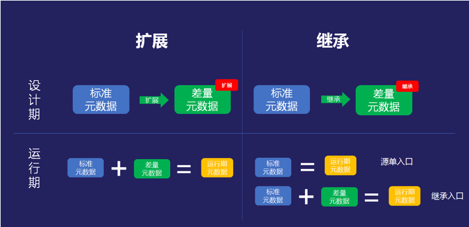
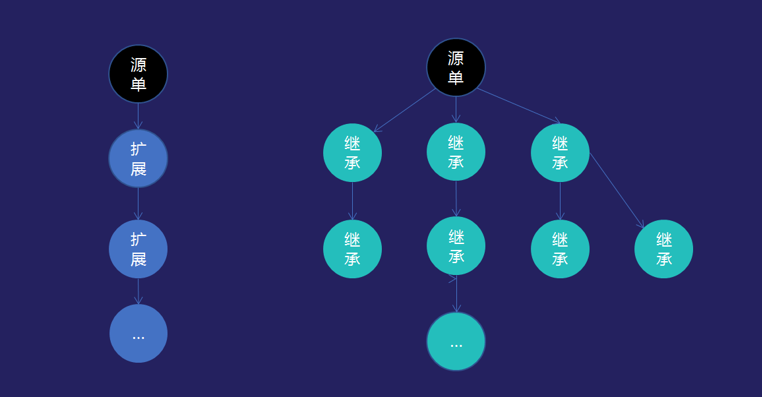

# 金蝶云苍穹的Extension与Nop平台的Delta的区别

最近有同学介绍我看一篇金蝶云苍穹的文章，[都1202年了，听说还有人不知道扩展与继承的区别](https://developer.kingdee.com/article/263716004755702784?productLineId=29&lang=zh-CN)，这其中介绍了一个有别于传统继承概念的所谓 扩展(Extension)概念。这个概念也不是云苍穹原创的，在odoo框架中就存在类似的做法，参见[继承和扩展](https://www.cnblogs.com/baishoujing/p/6399147.html)。一个有趣的问题是，Nop平台中的`x:extends`运算和云苍穹的扩展是同一个概念吗？答案是：并不是同一个概念，**扩展只是一种AdHoc式的针对具体问题的不完整的解决方案**，而Nop平台中的Delta合并，则是更高层面的抽象，它在数学层面上定义了完备的数学运算机制，相当于是引入了一种标准化的、新的底层语法结构。

## 一. 继承与扩展的区别

在云苍穹的定义中

> 扩展与继承统称为扩展开发，是金蝶云苍穹提供的对已有实体进行个性化开发时采取的开发模式。  



从云苍穹的文章中可以看出，他们已经明确意识到了扩展本质上是一种差量数据（Delta)。继承在抽象层面上是标准结构结合差量结构产生一个新的结构。也就是说，继承是保持原有的结构和原有的实体名不变，但是增加了一个新的实体名和新的实体结构。

> ClassB = ClassA  + Delta

而扩展是结合差量结构后直接替换原有的结构。也就是说，**保持实体的名不变，这样所有使用到该实体的地方都会自动使用扩展后的实体结构**。

> ClassA <- ClassA + Delta

## 二. Delta差量与Extension扩展的区别

可逆计算理论是我于2007年左右提出的支持面向语言编程范式（Language Oriented Programming）的下一代软件构造理论，它在数学层面定义了一整套严谨的Delta差量运算机制，并通过XLang程序语言将它们固化为具体的程序语法结构。可逆计算理论中的Delta差量是真正原创的概念，它的思想来源是物理学和数学中的微分动力系统、微扰论、熵增原理、群论等基础理论，与软件工程领域已有的扩展概念并没有直接关系。

> 关于可逆计算理论的介绍，参见[可逆计算：下一代软件构造理论](https://zhuanlan.zhihu.com/p/64004026)和[可逆计算理论中的可逆到底指的是什么？](https://www.zhihu.com/question/645650082)。

与可逆计算理论中的Delta概念相比，**扩展可以看作是一种基于程序员经验总结的、面向特定应用场景的、AdHoc式的一种具体解决方案，而Delta则是一种系统化的、数学层面上具有严谨定义的、应用范围更广的一种通用软件构造原理**（Docker技术就可以看作是可逆计算的一个具体实例）。具体来说，有如下区别

### 2.1 云苍穹的扩展只针对少数具体的模型

云苍穹中的扩展主要应用于实体模型和视图模型等少数固定模型，而且为了支持扩展概念，需要在实体模型引擎和视图模型引擎中增加相应的实现代码。也就是说，它是针对少数几个特定模型特殊设计和开发的机制。针对每一个模型，具体的差量内容和差量合并规则都需要特殊编码去实现。换句话说，**并没有统一的差量结构定义规则和差量结构合并规则，云苍穹是在具体的模型层面针对每一个模型去定义对应的扩展机制**。

> EntityModelA <-MergerForEntityModel(EntityModelA, DeltaForEntityModel)
> 
> ViewModelA <- MergerForViewModel(ViewModelA, DeltaForViewModel)

具体实现过程大概是，先解析得到EntityModel对象，然后再应用某个EntityModelMerger来合并EntityModel和DeltaForEntityModel。具体的合并算法针对不同的模型需要单独进行编制。

可逆计算中的Delta差量合并是在模型层之下的统一的结构层完成，与具体的模型无关，合并规则由xdef元模型来规定。

> XNode = Loader(virtualPath)
> 
> Model = Parser(XNode)

Nop平台中我们是通过虚拟文件系统来统一管理模型文件，然后使用统一的XNode加载器解析得到通用的XNode节点，在这个过程中会实现Delta合并算法。得到XNode之后我们再解析XNode得到具体的模型。也就是说，并不是`EntityModel = EntityModel + Delta`，而是`XNode = XNode + Delta`, `EntityModel = Parser(XNode)`。Delta差量合并不是作用于具体的模型层面，而是作用于元模型约束下的XNode统一结构层面。

**所有的数学定理只要证明一次，世界上所有其他人就不要证明了**。类似的，Delta的运算规律只要在Nop平台中定义一次，所有的模型（包括现在和未来可能的模型）就都不需要实现了。相比于云苍穹的扩展概念，Delta差量是在更高的抽象层面上定义，它与扩展是本质上不同的做法。

具体XNode合并算法的介绍，参见[XDSL：通用的领域特定语言设计](https://mp.weixin.qq.com/s/usInt7_odzvFzuiIUPw4iQ)和[通用的Delta差量化机制](https://mp.weixin.qq.com/s/27x95zc-YrVCBPhedBPq5w)

## 2.2 Delta差量合并作用于Tree结构并且包含删除语义

传统的继承和扩展本质上都是基于类结构的，而类是一个两级结构：类名+成员列表。在一个类中，我们通过方法名和属性名定位到具体的某一个方法或者属性。如果从结构层面看，类就相当于是一个Map结构，类的继承和扩展在结构层面上可以被理解为Map的覆盖合并。

```
Map = Map extends Map
```

 如果有一个属性具有内部结构，比如它是一个对象或者一个列表，那么一般的类扩展只会整体覆盖该属性，并没有一种合适的方法来定位到属性内部的某个条目或者子属性。

可逆计算理论中明确引入了领域坐标系的概念，强调每一个语法节点都具有唯一的可用于定位的领域坐标，如果采用分层坐标，很自然的就构成一个树结构。树结构中，从根节点到当前节点的路径就是这个节点的一种绝对坐标，节点在父节点中的名称可以看作是它在父节点范围内的相对坐标。Delta差量合并定义在树结构上而不是Map结构上

```
Tree = Tree x-extends Tree
```

在使用XML存储形式时，我们为XML节点引入了特殊约定的`x:extends`属性

```xml
<orm x:schema="/nop/schema/orm/orm.xdef"
     x:extends="base.orm.xml">
    <x:post-extends>
        <orm-gen:JsonComponentSupport xpl:lib="/nop/orm/xlib/orm-gen.xlib"/>
    </x:post-extends>
    <entities>
      <entity name="xxx.MyEntity">
            <columns>
                <column name="jsonExt" code="JSON_EXT" propId="101" tagSet="json"                           stdSqlType="VARCHAR"
                        precision="4000"/>
                <column name="status" x:override="remove" />
            </columns>
        <!-- 最终会自动生成component配置
           <components>
              <component name="jsonExtComponent"
                         class="io.nop.orm.component.JsonOrmComponent">
                 <prop name="jsonText" column="jsonExt" />
              </component>
           </components>
         -->
      </entity>
    </entities>
</orm> 
```

通过`x:extends`可以继承已有的Tree结构，然后可以任意定制这个复杂嵌套的Tree结构中的任意一个节点上任意属性。从根节点向下进行合并时，如果是集合节点，要求这个集合元素必须具有name/id这种可以用于唯一定位的标识属性。

Delta差量合并提供了删除语义，例如上面的例子中`x:override="remove"`表示删除本节点。传统的继承、扩展等机制一般都没有提供真正的删除语义，大部分是新增语义，修改语义都很少。但是可逆计算是面向程序结构长期演化的软件构造理论，演化一定是要允许破坏已有结构的，所以它必然包含删除和更新语义。

除了两个静态Tree结构之间的合并运算之外，可逆计算理论的完整形式需要引入动态Generator。

```
App = Delta x-extends Generator<DSL>
```

反映到结构层面就是

```
Tree = Tree x-extends Tree<Tree>
```

> 整个应用程序可以用一个Tree来表达（源码目录树+源码内部的抽象语法树），Delta本身也可以用Tree表达。Generator本质上就是一段代码，可以用抽象语法树(Abstract Syntax Tree)来表达，而DSL领域特定语言同样是使用AST来表达。

在上面的例子中，`x:post-extends`就是一种动态生成机制，它可以动态生成base节点用于Delta合并。

### 2.3 完整的关于Delta差量的理论

云苍穹的扩展概念虽然提到了差量，但是对于差量的理解局限于浅层的常识层面，而可逆计算理论中的Delta差量则接近于数学中群(Group)的概念，在概念的一致性和完备性方面远远超过扩展。关于群和Delta差量的关系，可以参见[写给程序员的差量概念辨析,以Git和Docker为例](https://mp.weixin.qq.com/s/D5bDNkMJ9gYrFb0uDj2EzQ)。

首先，根据 A = 0 + A，任何全量都是差量的特例，我们完全可以采用同样的形式来表达差量和全量，没有必要为差量单独定义一个特殊的形式。如果差量和全量采用同样的形式，那么一个必然的推论就是**差量的差量也是一个普通的差量**，我们可以引入更丰富的差量应用模式。

第二，可逆计算中的差量满足结合律，我们可以利用它定义独立于Base的差量合并运算，实现差量的独立管理。换句话说，在不知道应用到哪个Base之前，我们就可以将多个Delta合并在一起构成一个新的Delta。

```
A = (B+Delta1) + Delta2 = B + (Delta1 + Delta2)
```

第三， 可逆计算中的差量独立于Base存在，同一个差量可以作用于多个不同的Base。

```
A = A1 + Delta,  B = B1 + Delta
```

利用这一点，我们可以开发出新的软件复用模式。比如通过一个工作流的Delta来为任意实体引入工作流支持等。
在Nop平台中，我们将元编程和Delta差量结合在一起，实现了大量传统软件工程中无法想象的高阶复用模式。而且它们全部在编译期完成，对运行期性能没有任何影响，也不会把复杂性带到运行时。

更多介绍参见[写给程序员的可逆计算理论辨析](https://mp.weixin.qq.com/s/aT99VX6ecmZXdemBPnBcoQ)和[写给程序员的可逆计算理论辨析补遗](https://mp.weixin.qq.com/s/zGfo7pvKjOCa11PYLJHzzA)

### 2.4 多个Delta分支



 在云苍穹的文章中，提到扩展和继承的一个区别是"一个单只能扩展一次，但是可以对扩展之后的单再次扩展。而一个单可以继承多次，继承后的单也可以继续继承多次"。也就是如上图所示，扩展只能形成唯一的扩展链，而继承则可以形成多个不同的继承链。但是在可逆计算理论中，Delta差量并不存在这种限制。在Nop平台的具体实现中，我们可以通过给Delta赋予不同的名字，从而允许存在多条Delta扩展链。例如

```
/_delta/hunan/abc
/_delta/anhui/abc
/_delta/product/abc
/abc
```

上面的示例中，`/_delta/hunan/abc`表示在`deltaId=hunan`的Delta层中定义了abc这个文件，而`/_delta/product/abc`则表示在`deltaId=product`的Delta层中定义了abc这个文件。
在`/_delta/hunan/abc`文件中，我们可以通过`x:extends="super"`来表示继承上一层的内容，如果没有设置`x:extends`属性，则表示当前文件会覆盖上一层的文件，而不是实现两者的合并。

在配置文件中，我们可以通过`nop.core.vfs.delta-layer-ids=hunan,product`来控制如何实现多个Delta层之间的堆叠。也就是说，**利用这种额外的装配机制，我们可以突破云苍穹中只允许单一扩展链的限制**。

## 三. 可逆计算的具体实现
虽然不知道云苍穹的扩展机制的具体实现，但如果要在模型层实现，必然会导致大量冗余的代码，还很容易产生各种潜在的不一致性。在Nop平台中，实现差量运算和动态差量生成只需要数千行代码（不考虑XScript脚本语言自身的实现，本质上也可以利用现有的脚本语言引擎，但是会缺少一些方便的元编程机制），而且所有的可逆计算支持可以被封装在统一的模型加载器抽象之下。也就是说，只要将普通Java工程中常用的`JsonReader.readJson(classPath)`调用替换成Nop平台的`ResourceComponentManager.instance().loadComponentModel(virtualPath)`我们就可以立刻获得差量合并、动态模型生成、模型解析缓存、模型依赖追踪等一系列差量运算支持机制。同时可以自动获得多租户支持，每个租户都可以具有自己不同的Delta差量定义。设计原理的介绍参见[从张量积看低代码平台的设计]()
