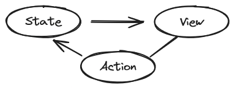

# 从React Hooks看React的本质

后jQuery时代的前端革命是由AngularJs发起的，它最初的一个想法是将后台的技术架构复制到前台来。后端的一个核心技术是所谓的模板技术(template)。它可以用一个公式来描述

```
html = template(vars)
```

这是一个特别直观的想法：模板就是一个普通函数，它根据传入的变量信息（无特殊要求）拼接得到字符串（无特殊结构）。这一模型完全不需要考虑面向对象传统的状态分散管理的问题，基本上是一种函数式的解决方案。

React的模式相当于是对模板渲染模型的一个**面向领域结构的改进**

```
vdom = render(viewModel)
```

vdom是面向浏览器的领域模型，而viewModel是基于业务领域概念所建立的页面显示模型，**render相当于是两个模型世界之间的传送门**。

传统上我们编程时是必须要知道界面模型的。我们所依赖的基础设施是浏览器内置的DOM结构和事件bubble机制，总是监听在DOM节点上，总是拿到具体的控件，然后从控件上拉取我们所需要的数据。而在React的模式下，我们首先在JS中建立模型，这个模型包含具体的领域知识，在领域内部的操作是更加直接的，而且可以利用程序语言所提供的各种抽象手段。典型的，在jQuery时代我们需要频繁的使用$el.find(".title")这种形式去动态查找到所需的元素，而在js模型中我们一般通过this.title属性即可直接定位到所需要的数据。实际上我们对于弱耦合的事件机制的依赖是大大下降了的，特别是我们一般不再需要业务含义不明确的事件bubble处理。redux和vuex从某种意义上可以看作是面向领域的消息总线，它们一般都是直接派发到具体的监听器，而且这些监听器的入口函数不再是某种通用的、与业务无关的Event对象，而是具体的领域状态对象state和业务参数param。

在新的范式下，viewModel的构造和管理成为一个独立的问题。而界面组件之间也不再直接交互，它们之间的关联通过共同依赖的js对象来得到隐式的表达。

```
component <--> js <--> component
```

如果我们改写一下形式，可以把React的本质看得更清楚一些：

```
viewModel => vdom
```

render函数可以看作是从viewModel上拉取领域数据，传送到vdom世界的一种信息管道。

但是我们知道，前端与后端有一个本质性的不同：前端是讲究交互性的，而后端强调的只是单向执行。因此，我们需要一个新的概念reactive，利用这个概念可以把上面的公式改写为

```
(props, @reactive state) => vdom
```

render函数是一种好不容易建立起来的信息管道，如果使用一次就随手丢弃，那实在是太浪费了，何不反复利用？通过引入具备响应性的状态变量，规定一个全局的响应式规则：“无论什么原因导致state变化，自动触发局部的render函数重新执行”，就可以使得render函数得到成功的升华，**完美的将微观的交互性嵌入到了宏观的信息流场景中**。

React兜兜转转很多年，一直没有能够找到最契合以上公式的技术表达形式，其本质原因还是在于受到了面向对象思想的束缚，总是意图带着面向对象的尾巴。直到Hooks机制横空出世，彻底和历史决裂，我们才看到了React本来就应该具有的面目：

```javascript
import React, { useState, useEffect } from 'react';

function FriendStatus(props) {
  const [isOnline, setIsOnline] = useState(null);

  useEffect(() => {
    function handleStatusChange(status) {
      setIsOnline(status.isOnline);
    }

    ChatAPI.subscribeToFriendStatus(props.friend.id, handleStatusChange);

    // 返回一个函数来进行额外的清理工作:
    return function cleanup() {
      ChatAPI.unsubscribeFromFriendStatus(props.friend.id, handleStatusChange);
    };
  });

  if (isOnline === null) {
    return 'Loading...';
  }
  return isOnline ? 'Online' : 'Offline';
}
```

为什么Hooks需要限制只能在代码的第一层调用 Hooks，不能在循环、条件分支或者嵌套函数中调用 Hooks？因为本来它应该写在参数区的，只是因为语法的限制导致它没有专有的位置而已。

现代框架技术的发展仔细回顾起来，其实可以看作是对传统面向对象封装概念的反叛史。面向对象强调先有对象，再有属性和方法，做事之前先拿到this。而现代框架强调的是全局规则，直接表达，为什么无论干什么事都要找个this指针绕一下呢？对比一下React此前的类组件

```javascript
class FriendStatus extends React.Component {
  constructor(props) {
    super(props);
    this.state = { isOnline: null };
    this.handleStatusChange = this.handleStatusChange.bind(this);
  }

  componentDidMount() {
    ChatAPI.subscribeToFriendStatus(
      this.props.friend.id,
      this.handleStatusChange
    );
  }

  componentWillUnmount() {
    ChatAPI.unsubscribeFromFriendStatus(
      this.props.friend.id,
      this.handleStatusChange
    );
  }

  handleStatusChange(status) {
    this.setState({
      isOnline: status.isOnline
    });
  }

  render() {
    if (this.state.isOnline === null) {
      return 'Loading...';
    }
    return this.state.isOnline ? 'Online' : 'Offline';
  }
}
```

真正的核心函数是render, 其他的都是外围支持性函数，这些函数之间通过this指针间接进行交互。仔细琢磨一下，我们不禁会有个疑问，所谓的生命周期函数为什么要从属于组件对象，它是局限于某个对象的知识吗？难道它的触发时刻不是一种全局知识吗？useEffect函数深刻理解了这一点，它成为一个静态函数，直接钩挂到全局执行引擎中，通过函数闭包直接实现多个生命周期回调函数之间的信息传递，而不是必须要造出某个this指针来随身携带。

长期以来，面向对象语言中存在三种标准的信息传递方式，参数（param）、全局变量（global）和成员变量（this），但是当面对复杂的领域模型时，我们经常需要表达某个局部范围内的隐含的背景知识，这是一种自定义的、与领域紧密相关的上下文变量（context），不应该显式传递。因此，数据驱动的核心公式可以被改进为

```javascript
   (props, @reactive state, @implicit context) => vdom
```

React Hooks中为implicit context这个概念也找到了一个对应的技术形式，把上下文定位方式确定为根据类型进行查找，相当于是某种import implicit机制。

```javascript
const user = useContext(CurrentUser);
const notifications = useContext(Notifications);
```

React Hooks机制的出现意味着面向对象组件会衰落下去吗？我想也不尽然。传统的力量是强大的，而有生命力的文化总是具有包容性的。我们在Hooks概念之前在Vue技术体系中就已经通过元编程大法解决了相应问题：在编译期声明在一起的代码块，可以通过元编程机制拆分后挂接到组件对象上的各种插槽上。作为一种运行时，面向对象完全没有任何问题。

问题： “作为一种运行时，面向对象完全没有任何问题。“ 这句话如何理解呢？
答： 框架层面的运行时，比如vue3.0，表面上看起来watch函数不再需要和对象绑定，但隐藏的实际存在一个currentInstance对象，相当于是一个隐蔽的this指针，大量的信息实际上仍然是和this指针绑定，围绕this指针进行组织的，与面向对象的一般做法本质上没有差异。

## 前端编程模型

从现在的角度上看，前端的编程模型大概如下所示：



render函数根据数据模型生成视图对象，而在视图对象上发生的交互会触发action动作，action负责修改数据对象，再借由响应式驱动机制自动触发数据对象到视图对象的渲染过程。底层借助于虚拟DOM的Diff算法，计算出实际要更新的视图模型的差量，尽量减少视图的实际更新范围，提升性能。

实际的编程模型要更加复杂，因为我们面对的是一个复杂的应用，而不是一个单一的组件，所以必然需要采用分而治之的方式进行分解，


所以前端的一个核心组织难点就是如何实现StateTree、ViewTree和ActionTree这三棵树之间的相互连接。

传统的组件编程实际上是以Component Tree为主，所有的状态数据和操作行为都挂接到Component对象上。而现在的主流方案是将状态数据独立出来管理，而Action和相关的状态变量一起构成所谓的Store。从理论上说，这种组织方式并不是唯一的，ActionTree也可以独立管理，只是我们需要有一种自然的机制将它和StateTree粘结在一起。理想情况下我们可以采用如下方案：

```
<input name="myField"/>
<span>{{state}} </span>
<button label="submit" v-on:click="submitForm" />
```

1. 展示和输入控件具有name属性，用于从StateTree的当前节点上拉取变量，并且如果修改可以自动更新回StateTree

2. 可以通过表达式从当前可见的StateTree节点上拉取变量信息。这里的可见性控制类似于一般程序语言中的词法作用域（Lexical Scope），相当于是由前台框架构建了一个应用层专用的闭包变量访问机制。（useXXX这种方案本质上是一种应用层自制的闭包机制）

3. 用户交互动作直接绑定到某个action函数上。action函数的定位也可以仿照数据变量的定位机制，从当前Action Scope向上查找，直到找到具有指定名称的处理函数。
