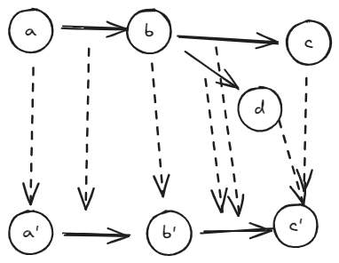

# 关于Nop平台底层理论的答疑

## 1. 代理对象=被代理对象时，代表双向可逆转换吗？

不是。**代理对象或者说任何一种基于接口或者多态实现的解决方案，都可以看作是一种数学上的同态（homomorphic）映射，在范畴论中也就是所谓的函子(Functor)映射**。

因为有很多同学反映对同态这一数学概念不熟悉，下面我们就用一种就用一种不严谨的方式来简单讲解一下。假设在空间F中存在对象a,b,c,d...，它们之间存在某种运算关系f,g,h...。

```
f(a,b), g(b,c),h(b,d), ...
```

同态映射 $\phi: F \rightarrow G $是将空间F中的对象和运算关系映射到空间G中，且保持原空间F中的结构关系，也就是说同态映射是一种所谓的**保结构映射**。

$$
\phi(f(a,b)) = \phi(f)(\phi(a),\phi(b)) = f'(a',b')
$$

在这里，对象`a`被映射为一个新的对象`a'`, 对象`b`被映射为一个新的对象`b'`，而a和b之间的运算关系`f`（可以看作是以a和b为参数的一个函数）被映射为一个新的运算关系`f'`。注意这里的要求是任意a和任意b之间的关系f通过$\phi$映射后都存在一个对应的`f'`，在这个意义上说，我们认为a和b之间的运算结构被保留了下来。也就是说对于**a和b之间的任何可能的运算**，在新的结构空间G中都有一个类似的运算`f'`。

如果我们把f(a,b)写成 $a\rightarrow b$，则可以更直观地理解这种所谓保结构的含义。



**同态映射允许空间F中的多个对象映射到空间G中的同一个对象**，比如上面的例子中c和d都映射到c'，这就很自然的形成一种化简机制：原空间F中的复杂关系映射到空间G中时可以减少元素数量和关系数量，从而相比于原先的结构实现简化，但是又保留了原先结构中的核心部分不变。

回到我们最开始的问题。接口或者说多态机制可以看作如下同态映射

```
f(objA,objB)  ==映射到接口空间==>  f'(interfaceA, interfaceB) 
```

在原有的对象空间中，可能的对象关系很多，但是如果我们考虑一个新的空间，其中只考虑少量接口对象，然后将原对象空间中的结构投影到接口空间，则我们需要认知的对象数量减少了，而且函数的数量也减少了，更特别的，代码形式上`f'`和`f`完全一样！但是我们需要认识到，对应于接口的函数f'和对应于对象的函数f完全相同并不是一件天经地义的事情。如果是基于泛型的某些语言，对于同样的函数源码，编译器也完全可能针对不同的对象生成不同的二进制代码。

**借助于同态映射这一概念，我们可以很清楚的看出接口或者说所谓多态概念的技术价值**。我们可以利用多态把真正需要编写的逻辑表达投影到一个子空间中，在子空间中保留了原始空间中的主要结构关系，不重要的细节关系被映射过程自动的隐藏起来。

可逆计算理论中的可逆具有多重含义，其中一个含义是可逆变换，而可逆变换是一种同构关系，同态可以看作是一种单向映射，而同构是一种双向映射。具体介绍参见[可逆计算理论中的可逆到底指的是什么？](https://mp.weixin.qq.com/s/Fngl7vYWhULn0VKeAEKPkQ)

## 2. PDF、HTML都可以看作是open api的多重表象。比如转换为HTML后，需要css加样式，这部分就无法转回去了，这个css是不是就是差量，把差量找出来很多东西就可以拓展并信息可逆？

在某种意义上说是的。

实际应用中我们接触的到变换大部分是近似等价 

```
A ~ F(B), G(A) ~ B
```

通过补充差量可以使得上面的关系成为等式

```
A + dA = F(B + dB), G(A + dA) = B + dB
```

因此，在Nop平台中一个关键设计就是所有细节处都允许存放扩展信息，也就是说永远采用`(data, ext_data)`这种配对的设计。当信息在某种形式中溢出的时候，可以找到地方存放。

在物理学中，所谓的可逆就意味着熵保持不变，也就是信息的守恒。需要像理解能量守恒定律那样理解这里的内在的规律性，这需要学过一点物理学。否则就会钻入细节中，总是在说凭什么永动机是不可能的？

很多人接触过的表象变换都具有某种局域性，一个属性在多个表象中也对应于局部的某种结构。但是物理学中最有用的是Fourier变换这种大范围的打碎重组。

表象变换还需要和最小化信息表达结合起来去理解。最小化信息表达意味着达到某种最优性，而达到最优性的东西一般是唯一的，否则我们就可以比较两个不同的东西，继续选择其中更优的那一个。而在数学上所谓的唯一性其实是通过等价关系来定义的。也就是说，数学上说A=B的时候并不是说A就是和B一摸一样的东西，而是说A和B之间存在双向可逆转换。因此，如果我们在实现框架的时候，总是要求最小化的信息表达，最终多个不同的框架都实现了最小化信息表达，这种最小化信息表达的唯一性就保证了不同的框架表达形式之间必然是可以进行等价变换的（可逆变换）

## 3. Nop使用Excel来定义模型，是不是在工程上不适合于git的版本管理

并不是这样。在Nop平台中Excel并不是直接起作用的，它等价于app.orm.xml。Excel仅仅是orm.xml的一个展现形式而已，相当于是一个展示缓存。Nop平台中真正使用的是app.orm.xml，没有Excel也完全可以运行，只不过从Excel来生成app.orm.xml便于保持代码和需求文档的一致性。而如果不使用Excel，那么有两种选择：

1. 使用代码驱动的方式，或者使用yaml文件定义，这种方式都不便于非技术的需求人员参与，也不便于和客户沟通。如果单独维护文档，则很容易出现文档和代码的不一致性。
2. 使用一个独立的模型管理软件，比如yapi用于管理API定义。但是这种方式需要单独部署应用，不太容易和DevOps自动化流程集成在一起。而在Nop平台中可以直接通过mvn打包工具自动读取Excel模型生成代码。

## 4. 什么是Delta? 每一次git的commit是不是一个delta？Nop其实是改变了commit的颗粒度，不再是代码行而是某种元能力？

git是定义在通用的行空间上，所以它用于领域问题是不稳定的，领域上的等价调整会导致行空间中的合并冲突。类似的还有Docker技术。很多人对Docker的理解是模块间的依赖解析计算能力。但是如果仅仅是这些功能，那么虚拟机不也可以做到吗？很多年以前就有python工具能管理依赖，动态生成虚拟机。这里本质性的差异就在于虚拟机的差量是定义在无结构的字节空间中，而docker是定义在结构化的文件空间中。
如果你怀疑差量有什么用，就想一下docker有什么用。docker是文件差量空间，Nop是更通用更系统化的差量空间。

## 5. 减法是不是可以通过节点上定义一个disabled属性来实现？

有些人可能想把DSL整合成一棵树，每个节点都增加disabled属性，在代码处理过程中，通过disabled来做逻辑上的剪枝。这种剪枝一般需要自己在运行期针对特殊的语义进行处理。Nop是领域结构空间所有DSL在编译期统一处理，不需要针对每个特殊情况处理。

## 6. 有什么功能是Nop平台可以很容易实现而其他技术不容易实现的？

Nop平台现在有一个特性是现有的软件工程不具备的，那就是粗粒度软件的复用。已经开发好一个系统，在完全不修改该系统的源码，不改变它的jar包的情况下，如何定制所有的业务逻辑？
基于Nop平台开发的产品是天生支持扩展的，它提供内置的Delta定制方案，这是一种系统化的，不需要预设扩展点的二次扩展机制。

定制之所以可行，必然需要能够在概念层面上稳定的定位到变化点，这就需要引入稳定的领域坐标系，这是Nop平台中的一个核心概念。其实有很多实践中的做法在理论层面都是非常模糊的，大部分人靠拍脑袋进行，而Nop平台的做法是在严谨的理论指导下进行，从而实现大量自动推理。

Nop平台并不是银弹，但它在理论上也是一种很大的进展，相当于引入了新的运算规则，扩大了问题的解空间，使得原先不存在通用解决方案的问题可以定义出通用的解了。
