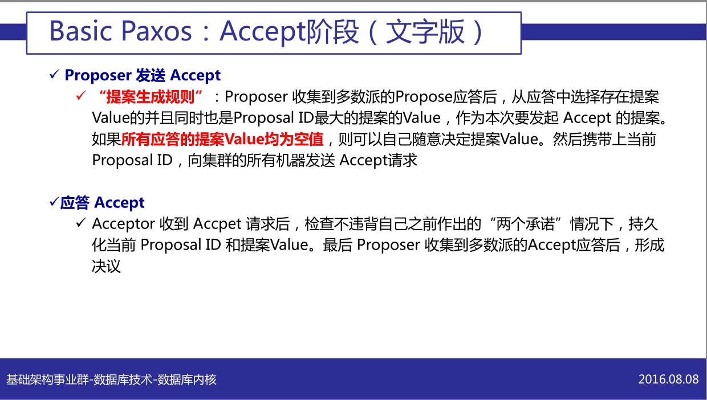
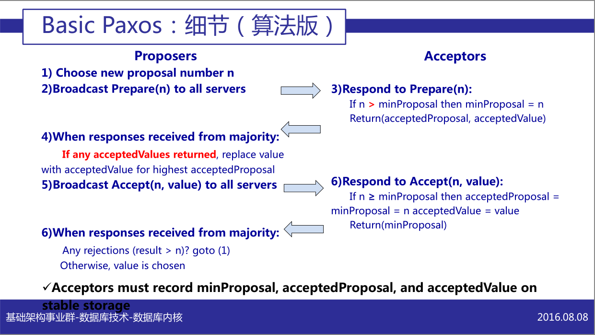
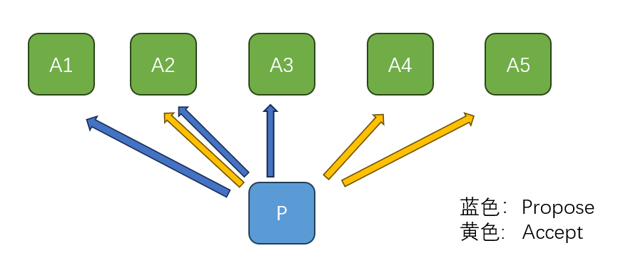

# 小学生也能轻松掌握的Paxos/Raft算法奥秘

Paxos算法是分布式领域中一个非常基本的算法，一向以晦涩烧脑著称。但是它之所以让人感到摸不着头脑，主要是因为我们不容易直观地理解它为什么要这样设计。尽管我们可以通过具体例子来验证其正确性，甚至可以用严谨的数学证明来说服自己它是对的，但我们还是很难回答，为什么一定要选择这种方式？这是否是唯一可行的方法？有没有可能不依赖数学推导，就能找到一种解释，让Paxos算法在直觉上显得不言而喻？

我在《[Paxos的魔法学研究报告](https://mp.weixin.qq.com/s/CVa_gUdCtdMEURs40CiXsA)》这篇文章中从异次元魔法学的角度为Paxos算法建立了一个魔法学图像，试图给出了一个Why的答案，而不仅仅是介绍Paxos算法“How to do”。本文是对上述文章的补充说明。

关于Paxos算法的基本知识，可以参考知乎上xp的文章 [200行代码实现基于paxos的kv存储](https://zhuanlan.zhihu.com/p/275710507), [可靠分布式系统-paxos的直观解释](https://zhuanlan.zhihu.com/p/145044486)

## 一. 为什么要学习Paxos算法？

或许有人会质疑，我的工作与分布式系统没什么关系，还有必要学习Paxos算法吗？答案是肯定的。只要你面临的问题涉及到多个状态空间，或者需要协调多个独立行动的实体，你就会遇到类似的问题，而Paxos算法提供的解决方案可以为你提供启示。

有人可能会提出，现在Raft算法更为流行，Paxos算法似乎不是那么常见。对此，我们可以这样理解：Raft算法实际上是Paxos算法的一个变种，它是在Paxos算法的基本原则指导下选择了一些特殊的实现策略。

将Paxos比作一个高层的接口定义可能更为恰当，它只涵盖了最基本的概念和策略。而Raft则是一种具体的实现，它补充了更多的实现细节，但是这些细节本质上是可选的，并不是实现分布式共识所必须的。

## 二. 什么是Paxos算法？

Paxos 解决的是分布式系统中达成共识的一个最简单的问题，即多个节点如何在可能发生故障的情况下就某个值达成一致。

正确的共识算法需要满足以下性质：

**一致性（Agreement）**: 所有的节点必须对同一个值达成一致。

**合法性（Validity）**: 这个达成一致的值只能来自于某个节点的提议。

**终止性（Termination）**: 最终所有节点会达成一致。

以上条件也被称为 Safety + Liveness，这是典型的既要又要，既要正确又要可行。一致性体现了共识的基本含义，而合法性用于排除一些平庸的情况，比如说所有节点约定不管外部提议是什么，我们都固定选择值是3，这样相当于是也可以形成共识，但是这种共识缺乏动态性，没有什么用。

共识算法所描绘的场景：一开始整个系统处于不确定状态，允许存在很多种可能性，比如值x和值y都可能，但是**执行完某个关键动作之后，整个系统会突然转变（类似于物理学中的相变，水突然冻成了冰），进入一种确定性的全局协同状态（凝固在某个选定的值上）**，按照算法的运行规则执行下去，最终所有的节点都会承认值只能是x，而不可能是y。

> 如果把参与共识算法的所有节点的所有动作按照一定的顺序组织成一个动作序列，则必然存在一个关键性动作，在这个动作执行之前允许多种可能，执行完这个动作之后结果固化。比如说一个Acceptor记录下一个值，则构成多数派，值被固化。如果它没有成功记录，则尚未构成多数派，还允许新的可能。
> 
> 虽然共识算法中所有节点都是并行运行的，但是在事后我们总是可以将所有动作组织成一个动作序列，并识别出其中的关键转变动作。

有趣的是，系统有没有可能进入一种类似薛定谔猫的状态，即选定了值，又没有选定值呢？从观察者的角度看，确实会存在这种状态，但是Paxos算法解决了这个问题，它内置了一种观测手段，使得最终必然会出现波包塌缩，得到确定性的结果。

### FLP定理

有趣的是，**满足上面的三个条件的共识算法在绝对的意义上是不存在的**！FLP定理（Fischer, Lynch, and Paterson theorem）指出在完全异步的分布式系统中，不存在一种共识算法能够同时满足一致性、可靠性和终止性这三个条件。

异步模型指的是没有全局时钟，进程可以以任意速度执行，消息可以在任意时间到达，但是消息最终会被保证送达。

FLP本质上是在说，如果一个全知全能的神故意对共识的进程进行捣乱，每次在共识将要达成的前夕（在关键性的转变即将发生的时候）都将一个关键节点无限期挂起，则没有任何算法可以确保达成共识。幸运的是，在我们的世界中目前还没有发现这种无聊的神明，多尝试几次，总会有成功的运气。

### Paxos算法速览

以上图片出自阿里巴巴基础架构事业部何登成的ppt, [PaxosRaft 分布式一致性算法原理剖析及其在实战中的应用.pdf](https://github.com/hedengcheng/tech/blob/master/distributed/PaxosRaft%20%E5%88%86%E5%B8%83%E5%BC%8F%E4%B8%80%E8%87%B4%E6%80%A7%E7%AE%97%E6%B3%95%E5%8E%9F%E7%90%86%E5%89%96%E6%9E%90%E5%8F%8A%E5%85%B6%E5%9C%A8%E5%AE%9E%E6%88%98%E4%B8%AD%E7%9A%84%E5%BA%94%E7%94%A8.pdf)

值被chosen的定义： 值被多数（超过半数）的acceptor接受。

### 相对论、时间和分布式系统

[Time, Clocks and the Ordering of Events in a Distributed System(1978)](https://dl.acm.org/doi/pdf/10.1145/359545.359563)

是Lamport被引用次数最多的文章，也号称是分布式领域最重要的一篇文章。Lamport在对这篇文章的回顾中有这么一段话：

> The origin of this paper was the note [The Maintenance of Duplicate Databases](http://www.rfc-archive.org/getrfc.php?rfc=677) by Paul Johnson and Bob Thomas. I believe their note introduced the 
> idea of using message timestamps in a distributed algorithm. I happen to
>  have a solid, visceral understanding of special relativity .
>  This enabled me to grasp immediately the essence of what they were 
> trying to do. Special relativity teaches us that there is no invariant 
> total ordering of events in space-time; different observers can disagree
>  about which of two events happened first. There is only a partial order
>  in which an event e1 precedes an event e2 iff e1 can causally affect 
> e2. I realized that the essence of Johnson and Thomas’s algorithm was 
> the use of timestamps to provide a total ordering of events that was 
> consistent with the causal order. This realization may have been 
> brilliant. Having realized it, everything else was trivial. **Because 
> Thomas and Johnson didn’t understand exactly what they were doing**, they didn’t get the algorithm quite right; their algorithm permitted 
> anomalous behavior that essentially violated causality. I quickly wrote a
>  short note pointing this out and correcting the algorithm.

Lamport具有MIT的数学学士学位（1960年），并且是布兰迪斯大学的数学博士（1972年），系统化的学习过狭义相对论。Lamport的这段自述充分说明，**学好计算机必须要懂一点物理**！

爱因斯坦通过想象发射一个光子去探测周围的世界，发现了一个惊天的秘密：**不同地方的时间只具有因果关联所导致的偏序关系，时间线并不是唯一的**！Lamport看到别人的文章中描述了消息发送、消息时间戳这样的概念之后，立刻意识到消息传递和光子传播是一回事，这背后的物理图像就是狭义相对论。一旦意识到这一点，后面的逻辑推导就是完全平凡的！而**Thomas和Johnson吃亏在没有学好物理学，压根没有理解自己创造的算法到底在干什么事情，导致算法中存在微妙的错漏**。缺少物理图像的指引，难免会在关键的时候犯迷糊。

有趣的是，Lamport虽然受到了狭义相对论的指引，他在自己的文章中却只是大谈特谈逻辑时钟，只字未提狭义相对论，导致有些人还以为这是Lamport拍脑袋拍出来的神来之笔。

Lamport的关于Paxos的原始论文[The Part-Time Parliament](https://ying-zhang.github.io/dist/1989-paxos-cn/)在1998年好不容易正式发表之后，一堆人大呼看不懂，于是Lamport在2001年又写了[Paxos Made Simple](https://www.jianshu.com/p/1bbbfbe300d1)一文，开宗明义就是一句话：Paxos算法，当用日常语言来表述时，是非常简单的（The Paxos algorithm, when presented in plain English, is very simple）。在这篇文章中，Lamport对于Paxos提供了一个为什么如此设计的解释（Why），只是这种解释是基于一步步的数学推理，相当于是强按着别人的头迫使别人承认Paxos算法的合理性，结果必然是一堆人刚看的时候以为是懂了，但一转头又迷糊了。

物理学的学习和研究非常讲究物理图像，物理系的人永远不会老老实实的按照数学规则去推导，他们之所以相信某个推导结果完全是因为这个结果对应于合理的物理解释。那么对于Paxos算法，我们不禁要问，它背后的物理图像是什么？在Lamport的心底，是否还隐藏着一个不为人知的、非数学化的对Paxos算法必然性的理解？就像当年他对那帮搞计算机的家伙悄悄隐瞒了相对论的存在？

## 三. Paxos的魔法学图像

分布式系统的底色是生的自由、死的随机的一片混沌，矛盾冲突无处不在，但是Paxos算法却偏偏在这一片混沌之上建立了统一一致的共识世界，这看起来宛如神迹。但是，凡人是很难理解神迹的，他无法站在神的高度俯瞰众生，只能凭借自己有限的生活经验去追索揣摩神的意图，最终必然会产生属于凡人的困惑。

人神之分，在于神域。神域之中，言出法随。制定规则，是神的起点，而谦卑的接纳规则、并狡诈的利用规则则是人之本质。所谓天人鸿沟，尽在于此。但是如果人族起了不臣之心，幻想着他也是规则掌控者，那么是否可以洞察这凡间一切的不可思议？所谓僭越一念起，刹那天地宽。我们突然发现，神，作为凌驾于一切有限客体之上的最完满的存在，解决共识问题只需要三步：

1. 神说：要有时间

2. 神说：时间静止

3. 神说：值应是X
* 时间静止的前提是时间需要先存在

* 在已经存在时间的情况下，如果全宇宙的时间都静止下来，那么就不会出现任何意料之外的事情发生，此时神可以从容的去干任意他想干的事情。注意，我们总是通过观察变化来认知时间的存在，比如比较单摆的摆动和其他变化的比例关系。**如果时间静止，就意味着没有出现任何可观测的变化**。但这并不意味着完全没有变化发生，比如说如果在我们这个宇宙中所有的变化都齐刷刷的延迟1秒钟，我们是无法发现这种变化的。

* 在时间静止之后，神在多处直接指定相同的值即可。这样当时间重新流动之后，处于不同地点的人们会发现同样的值突然出现在眼前，共识已经达成。

我们的世界现在处于末法时代，天地间灵气耗尽，魔力散失，真正的魔法在这个世界上已经不复存在。但是，我们手上还有一台计算机。如果我们世界的底层是一台超级计算机，那这个世界的所有物理规律完全可能是由这台机器所模拟出来的。那么在现在这个低魔的世界中，是不是同样可以用手中的计算机去模拟高魔世界的魔法？

> 计算机的本质是图灵机，而图灵机的本质是它是万能模拟器，可以模拟一切计算过程，这就是所谓的图灵完备。

**Paxos算法是对时间静止这一九级魔法的模拟实现，而Leader based Paxos则是利用八级魔法-大傀儡术来节约魔力**。

一旦想清楚Paxos的真正秘密是它是来源于异次元的魔法学，剩下的就只是一些平凡的技术细节了。

> 这里需要的是世界观或者说认知范式的转换：我们为达到目标先设计一个自然法则，然后再去思考如何落实这个法则。就好像在编程中我们先设计一套接口，然后再去具体实现这些接口。

回想一下，**Paxos算法中Proposer和Acceptor的一系列动作本质上都是在保证时间的单向流动**。

1. Proposer 生成全局唯一且递增的Proposal ID，这个Proposal ID就是一种时间的标记，每个ID对应一个唯一的时刻。

2. Acceptor 收到Propose后，为什么不再应答 Proposal ID 小于等于当前请求的 Propose？因为时间是单向流动的，Propose成功表示时间静止的开始，在时刻t静止，就不能再在小于时刻t的时刻静止。

3. Acceptor 收到Propose后，为什么不再应答 Proposal ID 小于当前请求的 Accept请求？从Propose到Accept是时间静止的阶段，所以我们可以接受时间静止开始时刻t对应的Accept，但是不能接受小于时刻t的时间的Accept。

在我们这个低魔的世界中模拟魔法，最基本的手段是认知删除，也就说，将一切不符合魔法学原理的事实从我们的认知中删除就好了，**看不见的就不存在！**  Acceptor一系列看起来古怪的行为只是在忽略那些会导致时间静止魔法穿帮的事实而已。

## 微观与宏观

时间静止在主世界中发生。主世界的时间线类似于宏观世界，而小世界的时间线类似于微观世界。

微观上可能有些成功了，有些失败了，但只要大多数(Majority)成功了，则我们就定义它在宏观上成功了。因为一个Majority不可能既是X，又不是X，所以这种宏观定义是明确的。

## 2PC与量子纠缠态

2PC（两阶段提交）可以看作是由Coordinator提供一致性的来源，各个Participant逐渐和Coordinator建立纠缠。而Paxos是逐步建立一个Quorum，Quorum中的参与者纠缠在一起。

2PC运行之前，各个Participant都是可以独立选择成功或者失败，也就是说结果是随机的。第一阶段运行完毕之后，如果单独去观察每一个Participant，它仍然是可能成功或者失败，结果仍然是随机的。但是如果我们观察整个状态空间，却会发现状态空间中可行的状态被削减了，只有部分纠缠态存留下来。

$$
|成功,成功\rangle + |失败,失败\rangle 
$$

关于量子纠缠态，以下是智谱清言AI的介绍：

量子纠缠态是量子力学中一个非常特殊且非经典的现象，它描述了两个或多个粒子之间的一种强相关性，即使这些粒子被分隔得非常远，它们之间的状态仍然可以即时地相互影响。

假设我们有两个粒子A和B，它们可以被制备在一个特殊的量子态中，比如一个纠缠态。一个简单的纠缠态例子是贝尔态（Bell state）之一，可以表示为：

$$
\frac{1}{\sqrt{2}} (|00\rangle + |11\rangle) 
$$

在这个态中，"0" 和 "1" 分别代表粒子的某种量子属性（比如自旋方向）的两个可能状态，而 $|00\rangle$ 表示粒子A处于状态"0"且粒子B处于状态"0"，$|11\rangle$ 则表示粒子A处于状态"1"且粒子B处于状态"1"。

#### 纠缠粒子的行为

当粒子A和B处于上述纠缠态时，不论它们相隔多远，以下现象会发生：

- **测量一致性**：假设我们在粒子A的位置测量它的状态，并且发现它处于状态"0"。由于粒子A和B处于纠缠态，粒子B的状态将会立即确定为"0"，即使它距离粒子A非常远。如果我们测量粒子B并发现它处于状态"1"，那么粒子A的状态也立即确定为"1"。这种即时的状态关联是量子纠缠的一个关键特征。
- **随机性**：在纠缠态中，当我们测量粒子A或B时，我们无法预测具体会得到"0"还是"1"，因为纠缠态是这两个结果的叠加。然而，一旦我们测量了其中一个粒子，另一个粒子的状态也会立即确定，并且与第一个粒子的测量结果相关。
- **非局域性**：量子纠缠展现了非局域性，意味着粒子A的状态可以即时影响粒子B的状态，而不需要任何信号在它们之间传递。这一点违反了经典物理学中的局域实在论，即物理效应不可能瞬间传递。

===========智谱清言AI创作完毕========

## 

## 一些常见问题

## 成员变更

成员变更的约束条件：

- 上一个 config 在当前 commit_index 上提交后才允许 propose 下一个配置.

- 下一个配置必须跟最后一个已提交的配置有交集.也就是任意两个quorum必须有交集。

## Quorum并不需要是Majority

Quorum（法定代表）的要求是任意两个quorum之间存在交集。比如，要求所有Quorum都包含一个指定元素a，这样也是合法的Quorum，只是不容错。`{{a},{a,b},{a,b,c},{a,c}}`

hierarchical quorum 

$$
Q' = (Q -  \{Q_i\}) \cup  \{\bar Q_i\}
$$

去掉一个quorum，然后再加上它的补集，我们得到的仍然是一个合法的quorum集合。

## 接受Accept消息的需要是此前返回Propose响应的Acceptor吗？

- Lamport专门强调了："This need not be the same set of acceptors that responded to the initial requests."
- 在第一阶段，我们可能从A1、A2、A3接收到了成功响应，然后我们并不需要向A1、A2、A3发起第二阶段请求，而是完全可以选择其他的节点发起请求。Paxos只要求多数派成功响应即可，并不要求第一阶段和第二阶段的多数派完全一样。

## Paxos算法的变体

参见[SoK: A Generalized Multi-Leader State Machine Replication Tutorial](https://escholarship.org/uc/item/9w79h2jg)

## Fast Paxos

如果很确定自己是第一个提出一个值的话，那么就可以安全地跳过第一阶段，直接进入第二阶段提交。Fast Paxos使用rnd=0直接尝试一次phase2写入。
为了防止第一次尝试写入冲突后正确执行，quorum需要`n*3/4`，这样后续paxos读取的时候至少要读取`1/2+`，在这`1/2`多中，已经写入的值仍然是多数派。

$$
[\frac 1 2 ] = (\frac 1 4) + [\frac 1 4]
$$

也就是说，时间可能冲突，但是仍然可以通过对多数派进行计数得到已经被选定的值。

如果一个值想要被快速提交，它不仅要得到大多数成员的认可，还要在大多数的大多数中得到认可，才能安全地提交。

`t=0`时刻存在两个活动者，所以我们需要新的信息来判断它们的执行顺序。

## EPaxos

记录deps, mmp3与EPaxos的不同在于它记录所有依赖的instance，包括所有间接依赖的，由此才能保证线性一致性。

## Paxos与 Raft

参考xp的文章 [将 paxos 和 raft 统一为一个协议: abstract-paxos](https://zhuanlan.zhihu.com/p/488629044)

Raft对 multi-paxos 没有明确定义的问题, 即多条日志之间的关系到底应该是怎样的, 给出了一个确定的答案.

Multi-Paxos: 很多instance共用一个Promise。

### 幽灵复现问题

某类没有提交且过时的日志可能被新 Leader 重新提交。也就是说在上一个leader没有达成共识的条目会不会在下一个Leader达成共识，从未知状态转成提交状态。

## Generalized Paxos

Multi-Paxos和Raft考虑的都是线性日志，日志中的条目构成一个全序(total order)集合：排在前面的日志总是要先执行。但是实际情况中日志中某些项的执行先后顺序是可以颠倒的，只要它们之间不存在冲突关系（比如读后写，写后读等），例如`a=1`和`b=2`这两个命令互不相关，可以交换执行顺序。泛化Paxos的做法是通过依赖服务来计算日志条目之间的偏序依赖关系，然后构成冲突图。

部署配置：

proposers: 至少f+1个节点

dependency service nodes: 2f + 1个节点

acceptors: 2f+1个

replicas: 至少f+1个

$deps(v_x)$是至少f+1个依赖服务节点所计算得到的依赖集合的并集。

依赖服务接收到x，再接收到与之冲突的y时，会增加一个节点$v_y$到节点$v_x$的箭头，$v_x \in deps(v_y)$

共识不变式： 对于每一个顶点 v ，最多只能够有一个值 `(x,deps(v))` ，就如同 Raft 的日志中，一个日志项要么没有提交，一旦提交了所有节点都是同一个值。

依赖不变式：形式化的描述了依赖图中的冲突关系。如果x和y存在冲突，则要么$v_i \in deps(v_y)$, 要么$v_y\in deps(v_x)$, 要么两者同时满足。

两个冲突的操作，可能是同时发起的，而不同的消息到达不同的依赖服务节点的顺序有可能不同，这就导致了在不同服务节点中的依赖关系可能不同。即使依赖服务维护的冲突图是无环的，Replica 中形成的冲突图也有可能有环。
