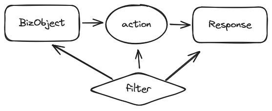

# Nop入门：如何实现复杂查询

B站视频：https://www.bilibili.com/video/BV1c1421i72k/

Nop平台中查询服务的执行过程包含三个主要部分：

1. 定位到服务对象
2. 调用服务对象上的服务函数
3. 对返回结果进行再加工

在这三个部分中，我们都可以插入过滤条件和排序条件

例如  `/r/NopAuthSite__findList?@selection=id,resources{resoureName}`调用链接可以映射到业务对象NopAuthSite对象的findList方法，然后选择性的返回指定的结果字段



## 一. 对象层面的过滤条件和排序条件

在XMeta元数据模型文件中可以增加filter和orderBy段，所有涉及到这个服务对象的操作都会自动追加对应条件。特别是当新增和修改的时候，也会自动设置实体属性满足filter配置要求

```xml
<meta>
  <filter>
    <eq name="siteId" value="main" />
  </filter>
</meta>
```

这个机制可以用于在一个数据库存储表中保存多个业务上有区别的业务实体。例如仓储管理中，物资实体的具体属性根据类型不同可能有着较大的差异，
为每个物资类型单独增加一个XMeta文件可以为不同的物资类型定制不同的扩展字段和显示界面。

此外，不同的对象名可以映射到不同的数据权限配置

```xml
<data-auth x:schema="/nop/schema/data-auth.xdef" xmlns:x="/nop/schema/xdsl.xdef">
    <objs>
        <obj name="NopAuthUser">
            <role-auths>
                <role-auth roleId="nop-admin">
                </role-auth>

                <role-auth roleId="user">
                    <filter>
                        <eq name="tenantId" value="${$context.tenantId}"/>
                    </filter>
                </role-auth>
            </role-auths>
        </obj>
    </objs>
</data-auth>
```

我们可以选择从某个已有的XMeta模型继承，产生新的业务对象。只需要在`app.beans.xml`中配置对应的BizModel，就可以自动按照服务对象名关联到对应的XMeta元模型。

```xml
    <bean id="NopAuthResourceBizModel_main" class="io.nop.auth.service.entity.NopAuthResourceBizModel">
        <property name="bizObjName" value="NopAuthResource_main"/>
    </bean>
```

`/nop/auth/model/NopAuthResource/NopAuthResource_main.xmeta`文件可以选择从已存在的NopAuthResource.xmeta文件继承

```xml
<meta x:extends="NopAuthResource.xmeta">
  ...
</meta>
```

## 二. 在XBiz模型文件中通过Xpl标签增加过滤和排序条件

在XMeta中增加filter会影响到save和update函数。如果只是想为某个特定业务查询请求增加过滤条件，比如查询当前被激活的记录，则我们可以在XBiz模型中进行配置。

```xml
<biz x:schema="/nop/schema/biz/xbiz.xdef" xmlns:x="/nop/schema/xdsl.xdef"
     x:extends="_NopAuthUser.xbiz" xmlns:bo="bo" xmlns:c="c">

    <actions>
        <query name="active_findPage" x:prototype="findPage">

            <source>
                <c:import class="io.nop.auth.api.AuthApiConstants" />

                <bo:DoFindPage query="${query}" selection="${selection}" xpl:lib="/nop/biz/xlib/bo.xlib">
                    <filter>
                        <eq name="status" value="${AuthApiConstants.USER_STATUS_ACTIVE}" />
                    </filter>
                </bo:DoFindPage>
            </source>
        </query>
    </actions>
</biz>
```

* `x:prototype`表示从已有的findPage函数继承输入参数和返回值类型定义
* `bo.xlib`提供了对`doFindPage/doUpdate`等帮助函数的封装，可以在调用这些函数的时候传入附加处理逻辑。`<bo:DoFindPage>`利用xpl模板语言的封装能力，提供了非常直观的filter配置方式
* xbiz模型文件可以看作是一种XML格式的配置文件，完全可以通过可视化设计器在线设计函数实现逻辑，并利用Nop平台中的模型动态加载能力实现在线更新。

更进一步的介绍可以参见[filter.md](../../dev-guide/recipe/filter-list.md)

## 三. 在XMeta中为prop增加关联查询配置

Nop平台中服务函数的返回值并不会被直接序列化为JSON返回到前台，而是会经过NopGraphQL引擎的结果映射处理，在这个过程中可以执行非常复杂的DataFetcher数据加载逻辑。

当我们需要对查询到的子表记录增加过滤和排序条件时，可以在XMeta中的prop节点上配置`graphql:queryMethod`属性，从而利用`OrmEntityConnectionFetcher`来实现子表过滤和排序。

```xml
<meta x:schema="/nop/schema/xmeta.xdef" xmlns:x="/nop/schema/xdsl.xdef" x:extends="_NopAuthSite.xmeta"
      xmlns:graphql="graphql">
    <props>
        <prop name="resourcesList" displayName="资源列表" 
            graphql:queryMethod="findList" lazy="true">
            <schema bizObjName="NopAuthResource"/>

            <graphql:filter>
                <eq name="siteId" value="@prop-ref:siteId"/>
            </graphql:filter>

            <graphql:orderBy>
                <field name="orderNo" desc="false"/>
            </graphql:orderBy>
        </prop>
    </props>
</meta>
```

* `graphql:queryMethod`支持findCount/findFirst/findList/findPage/findConnection等多种枚举值，每个枚举值对应不同的返回结果类型。但是所有情况下输入参数类型都是GraphQLConnectionInput。
* 通过bizObjName属性指定关联的子表实体对象。
* 并不需要当前实体和关联实体在ORM层面存在关联关系。通过`<graphql:filter>`可以增加关联查询条件。`@prop-ref:`前缀表示从当前实体上获取属性值用于关联查询。

如果存在ORM层面的关联属性，则上面的配置可以简化

```xml
<meta x:schema="/nop/schema/xmeta.xdef" xmlns:x="/nop/schema/xdsl.xdef" x:extends="_NopAuthSite.xmeta"
      xmlns:graphql="graphql">
    <props>
        <prop name="resourcesList" displayName="资源列表" 
           graphql:queryMethod="findList" lazy="true" 
           graphql:connectionProp="resources">
            <schema bizObjName="NopAuthResource"/>
            <graphql:orderBy>
                <field name="orderNo" desc="false"/>
            </graphql:orderBy>
        </prop>
    </props>
</meta>
```

* 通过`graphql:connectionProp`可以指定ORM层面的关联属性，通过它可以自动推理得到`graphql:filter`配置。此时如果再配置`graphql:filter`就表示在关联查询条件的基础上再补充额外的过滤条件
* findConnection对应于返回结果为GraphQLConnection类型。关于它的具体介绍，参见[connection.md](../../dev-guide/graphql/connection.md)

在REST调用模式下，我们可以通过`_subArgs.{propName}.filter_xx=yy`这种形式来传递子表过滤条件

```
http://localhost:8080/r/NopAuthSite__get?id=main&%40selection=id,displayName,resourcesList%7Bid%7D&_subArgs.resourcesList.filter_status=1
```

* 通过`@selection`可以传递类似GraphQL的字段映射配置，此时**特殊字符`@`和大括号等需要进行编码处理**，否则后台解析URL的时候报错，会返回400错误码。

通过GraphQL协议调用的时候可以传递更加复杂的and/or条件

```graphql
query($filter:Map){
    NopAuthSite_get(id:"main"){
        id,
        displayName,
        resourcesList(filter:$filter,limit:10,offset:0){
           id, displayName
        }
    }
}

variables:
  filter: {
     "$type": "or",
     "$body": [
        { "$type": "eq", "status", 1},
        { "$type": "eq", "status", 2}
     ]  
  }   
```

通过GraphQL提供的别名机制，我们可以利用同一个子表属性来返回不同的查询结果

```graphql
query($filter1:Map, $filter2: Map){
    NopAuthSite_get(id:"main"){
        id,
        displayName,
        activeResources: resourcesList(filter:$filter1,limit:10,offset:0){
           id, displayName
        }
        inactiveResources: resourcesList(filter:$filter2,limit:10,offset:0){
           id, displayName
        }
    }
}
```
